# Sistema Web de Departamento Pessoal

## Fluxos Integrados de Navegação e Telas

**Versão:** 1.1 — navegação simplificada, para revisão e aprovação  
**Etapa:** posterior ao Documento Mestre 07 e anterior aos protótipos  
**Fonte oficial das regras:** `07-documento-mestre-planejamento-funcional.md`  

> Este documento organiza como o usuário percorre o sistema. Ele não altera cálculos, permissões ou regras do Documento Mestre 07.

> **Revisão 1.1:** `Competências` e `Pagamentos` formam um único módulo; desligamentos ficam dentro de `Colaboradores`; recibos ficam dentro de `Competências e Pagamentos` e do participante; exportações são ações das telas de origem; `Notificações` permanece como item do menu lateral.

---

# 1. Objetivo desta etapa

Definir:

- Arquitetura de informação;
- Menu e cabeçalho;
- Inventário das telas;
- Entradas e saídas de cada tela;
- Fluxos integrados de trabalho;
- Estados vazios, erros e bloqueios;
- Navegação segura entre empresa, competência e registros;
- Ordem das telas que receberão protótipos na etapa seguinte.

Ainda não serão definidos nesta etapa:

- Aparência visual final;
- Cores e identidade visual;
- Medidas exatas de componentes;
- Tecnologia da interface;
- Modelo físico do banco;
- Contratos de API;
- Código.

---

# 2. Princípios de navegação

1. Nenhum dado empresarial aparece antes da autenticação completa;
2. Master conclui o TOTP antes do seletor;
3. Uma única empresa permanece ativa;
4. Empresa e CNPJ ficam visíveis em todas as telas empresariais;
5. Trocar empresa retorna ao seletor e limpa o contexto anterior;
6. Aba aberta na empresa anterior não pode salvar, confirmar, exportar ou baixar;
7. Competência fica destacada em todas as telas financeiras;
8. Menu, ações, totais e campos respeitam as permissões efetivas;
9. Painel e notificações somente direcionam; não pagam nem alteram diretamente;
10. Voltar de um detalhe preserva filtros, página e competência dentro da mesma empresa;
11. Sair de formulário alterado sem salvar exige confirmação;
12. Áreas globais são visualmente identificadas como `Escopo global`;
13. Nenhuma confirmação financeira ou clínica acontece implicitamente ao salvar cadastro;
14. Sucesso somente é exibido depois da confirmação do servidor e da auditoria;
15. A navegação nunca revela a existência de registro de outra empresa.

---

# 3. Arquitetura de informação

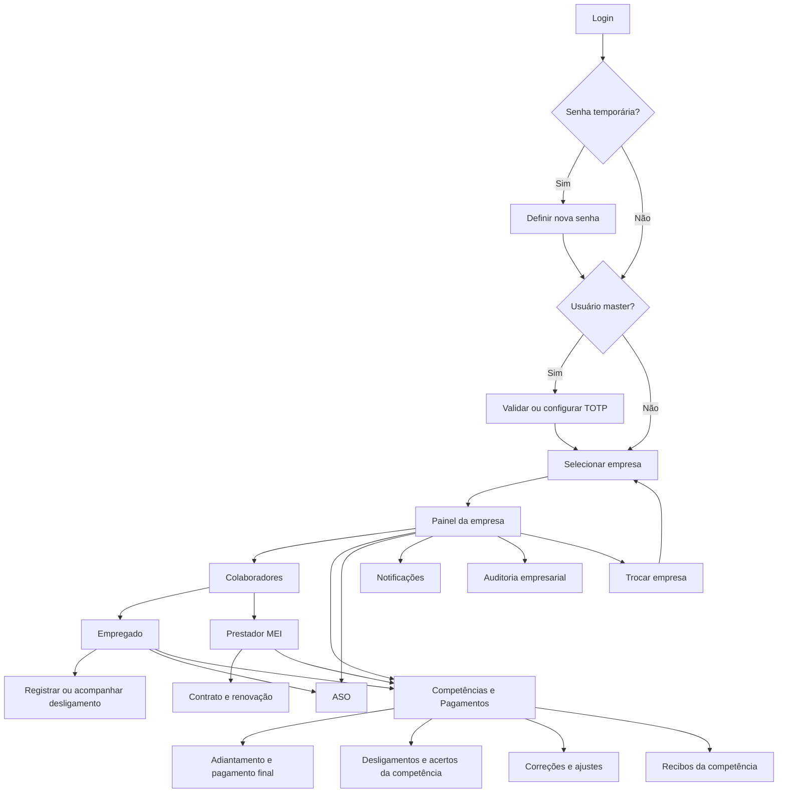

## 3.1 Área sem empresa ativa

- Login;
- Primeiro acesso;
- TOTP;
- Recuperação de senha;
- Seletor de empresa;
- Minha Conta;
- Administração global autorizada.

## 3.2 Área da empresa ativa

- Painel;
- Colaboradores;
- Competências e Pagamentos;
- ASO;
- Notificações;
- Auditoria empresarial;
- Perfis empresariais, somente para master e sempre identificando a empresa administrada.

## 3.3 Áreas globais

- Usuários, perfis globais e modelos iniciais, master-only;
- Auditoria global, master-only;
- Clínicas compartilhadas, conforme permissão global;
- Incidentes, acesso restrito;
- Modelos de perfil para novas empresas.

---

# 4. Estrutura global da interface

## 4.1 Cabeçalho empresarial

Elementos permanentes:

- Logo da empresa;
- Nome da empresa;
- CNPJ;
- Ação `Trocar empresa`;
- Sino de notificações, somente quando autorizado, contando apenas itens que o usuário pode conhecer;
- Nome do usuário;
- Menu `Minha Conta`;
- Ação `Sair`.

Em telas financeiras, acrescentar:

- Competência selecionada;
- Situação da competência;
- Versão, quando reaberta ou corrigida.

## 4.2 Cabeçalho global

Substitui a identificação da empresa por:

- Marcador `Escopo global`;
- Nome do usuário;
- Retorno à empresa ativa ou ao seletor;
- Minha Conta;
- Sair.

O marcador evita que usuário e master confundam uma ação global com uma operação do CNPJ selecionado.

## 4.3 Menu lateral empresarial

Ordem:

1. Painel;
2. Colaboradores;
3. Competências e Pagamentos;
4. ASO;
5. Notificações;
6. Auditoria, quando autorizado.

Itens sem permissão não aparecem.

### 4.3.1 Organização interna dos módulos

```text
Painel

Colaboradores
├── Lista, filtros e exportação
├── Empregado ou MEI
├── Desligamento do empregado
├── Recibos do participante
└── Histórico contextual

Competências e Pagamentos
├── Seletor de competência
├── Resumo e checklist
├── Participantes e cálculos
├── Adiantamento
├── Pagamento final
├── Desligamentos e acertos
├── Ajustes financeiros
├── Recibos
└── Exportar a competência

ASO
├── Pendências e acompanhamento
├── Exames realizados
├── Clínicas
└── Exportar ASOs

Notificações
└── Ativas e resolvidas recentemente

Auditoria
├── Pesquisa e filtros
├── Detalhe do evento
└── Exportação contextual
```

Desligamentos, recibos e exportações continuam existindo como funções completas. Apenas deixam de ocupar itens independentes no menu lateral e passam a aparecer no contexto em que o usuário trabalha.

## 4.4 Administração

Disponível pelo menu do usuário ou entrada própria:

- Configurações da empresa ativa, conforme permissão;
- Perfis empresariais da empresa ativa, master-only;
- Usuários, perfis globais e modelos iniciais, master-only;
- Auditoria global, master-only;
- Clínicas, conforme permissão global;
- Incidentes, acesso restrito.

Não existe uma tela separada de lista de empresas no menu operacional. Cadastro de empresa permanece no seletor.

## 4.5 Breadcrumb e retorno

Exemplos:

```text
Colaboradores > Maria da Silva > Condições financeiras

Competências e Pagamentos > 09/2026 > Pagamento final > RA e reembolso

ASO > Pendências demissionais > Maria da Silva
```

Regras:

- Detalhe sempre identifica a origem;
- Voltar preserva filtros e página;
- Link vindo de notificação retorna à central ou à lista filtrada;
- Troca de empresa elimina esse histórico de retorno;
- Link para registro sem empresa ativa exige seleção e nova validação.

---

# 5. Estados comuns de tela

| Código | Estado | Comportamento |
|---|---|---|
| V0 | Sem registros | Explica que não há cadastros e mostra ação somente se o usuário puder criar. |
| V1 | Filtro sem resultado | Informa que nenhum registro corresponde e oferece `Limpar filtros`. |
| L1 | Carregando | Usa estrutura neutra, sem reaproveitar dados da empresa anterior. |
| P1 | Processando | Bloqueia repetição e informa andamento. |
| S1 | Concluído | Exibido somente depois da confirmação segura do servidor. |
| E1 | Falha de carregamento | Mensagem amigável e ação `Tentar novamente`. |
| E2 | Sessão expirada | Interrompe a operação, limpa dados sensíveis e redireciona ao login. |
| E3 | Sem permissão | Não revela dados, totais ou existência de registros. |
| E4 | Contexto de aba antigo comprovado | Limpa conteúdo e exige reabertura no contexto atual. |
| E5 | Conflito de edição | Bloqueia salvamento e exige atualização. |
| E6 | Validação | Preserva dados permitidos, resume erros e foca o primeiro campo. |
| E7 | Arquivo indisponível | Trata igualmente arquivo expirado, inexistente ou sem acesso. |
| E8 | Falha de operação sensível | Informa que nenhuma alteração foi concluída. |
| E9 | Registro inexistente ou acesso cruzado | Responde genericamente como não encontrado, sem confirmar existência em outra empresa. |

## 5.1 Ações em andamento

Enquanto uma operação estiver sendo enviada:

- Salvar, calcular, confirmar, cancelar, reabrir, exportar ou gerar recibo fica temporariamente bloqueado;
- Duplo clique não gera nova operação;
- Se a resposta for incerta, o sistema consulta o estado atual antes de oferecer nova tentativa.

## 5.2 Alterações não salvas

Ao tentar:

- Trocar empresa;
- Sair da tela;
- Voltar pelo navegador;
- Encerrar sessão manualmente;

o sistema pergunta se o usuário deseja descartar as alterações.

Em expiração ou revogação de sessão, os dados sensíveis são limpos e não ficam armazenados para reapresentação automática.

---

# 6. Inventário de telas — acesso, empresa e conta

## A01 — Login

**Objetivo:** autenticar o usuário.

**Conteúdo:**

- E-mail;
- Senha;
- Ação `Entrar`;
- Link `Esqueci minha senha`.

**Saídas:**

- Primeiro acesso;
- TOTP do master;
- Seletor de empresa.

**Regras:**

- Mensagem não revela se e-mail existe, usuário está bloqueado ou senha está errada;
- Após cinco falhas, aplica bloqueio de 15 minutos;
- Não conserva a senha depois de falha;
- Nenhum dado empresarial é carregado.

## A02 — Primeiro acesso

**Objetivo:** substituir a senha temporária.

**Conteúdo:** nova senha, confirmação e regra mínima de 10 caracteres.

**Saída:** TOTP do master ou seletor.

**Bloqueios:** senha temporária vencida em 24 horas ou senha fora da política.

## A03 — Configuração inicial do TOTP

**Objetivo:** proteger a conta master antes do acesso.

**Conteúdo:**

- QR Code;
- Chave de configuração alternativa;
- Código de confirmação;
- Códigos de recuperação exibidos somente depois do sucesso.

Cada código de recuperação é de uso único: ao ser usado, é invalidado. Regenerar o conjunto invalida imediatamente todos os códigos anteriores.

**Saída:** seletor de empresa.

## A04 — Validação TOTP

**Objetivo:** concluir login do master.

**Conteúdo:** código TOTP e caminho secundário para código de recuperação.

**Saída:** seletor.

## A05 — Solicitar recuperação

**Conteúdo:** e-mail e resposta neutra.

**Saída:** login.

O sistema apresenta a mesma mensagem independentemente de o e-mail existir.

## A06 — Redefinir senha

**Entrada:** link único válido por 30 minutos.

**Conteúdo:** nova senha e confirmação.

**Resultado:** o token é consumido, as sessões são revogadas e o usuário retorna ao login. Para master, TOTP continua obrigatório.

## A07 — Seletor de empresa

**Objetivo:** definir o único contexto empresarial.

**Conteúdo:**

- Cartões das empresas autorizadas;
- Logo;
- Nome;
- CNPJ;
- Situação;
- Ação `Entrar`;
- Ação `Cadastrar empresa`, quando autorizada;
- Acesso a Minha Conta e Sair.

**Estado sem empresa:** informa que nenhuma empresa foi associada, sem mostrar dados empresariais.

Empresa inativa pode ser aberta apenas em `Modo histórico`, com identificação persistente. O servidor bloqueia criação, edição, cálculo, confirmação e qualquer nova operação, mantendo somente consultas autorizadas.

## A08 — Cadastro de empresa no seletor

**Conteúdo:** todos os campos aprovados, logo, padrões financeiros, competência inicial e modelo de perfil do criador.

**Ações:**

- `Salvar e entrar`;
- `Salvar e voltar`;
- Cancelar.

Usuário comum recebe uma cópia do perfil inicial. Master continua com acesso global.

## A09 — Minha Conta

**Disponível:** no seletor e na área empresarial.

**Conteúdo e ações:**

- Nome e e-mail somente leitura;
- Trocar senha com senha atual;
- Configurar TOTP, quando aplicável;
- Regenerar códigos após reautenticação, invalidando todos os códigos anteriores;
- Encerrar outras sessões;
- Sair.

Não permite alterar e-mail, empresas, perfis ou condição de master.

Trocar a senha revoga as sessões anteriores. Master não pode simplesmente desativar o TOTP obrigatório.

## A10 — Configurações da empresa ativa

**Origem:** administração da empresa depois que ela tiver sido selecionada e validada como contexto ativo.

**Conteúdo:** cadastro, logo, percentual, dias sugeridos, competência inicial e situação.

**Ações:** editar os dados e padrões permitidos, trocar logo e inativar quando não houver pendências.

A competência inicial fica somente para consulta depois da criação da empresa; a ação genérica de editar não altera o corte financeiro.

Não constitui um módulo de empresas separado.

---

# 7. Inventário de telas — painel e colaboradores

## P01 — Painel da empresa

**Objetivo:** resumir a situação da empresa e direcionar às pendências.

**Conteúdo:**

- Competência de referência;
- Indicadores cadastrais;
- Grupos financeiros;
- Pagamentos;
- Desligamentos;
- MEIs próximos do término;
- ASOs e pendências;
- Data da última atualização.

**Ações:** atualizar, trocar competência, abrir lista filtrada e trocar empresa.

Não existem ações de pagamento, correção ou resolução diretamente no painel.

**Competência inicial da sessão:**

1. Manter a competência que o usuário já escolheu na sessão;
2. Caso não exista escolha, usar a competência com pagamento próximo ou vencido;
3. Caso não exista, usar o mês atual, se cadastrado;
4. Caso não exista, usar a competência aberta mais recente;
5. Sem competência disponível, mostrar estado vazio e ação de criação apenas a quem puder criar.

## C01 — Lista de colaboradores

**Objetivo:** reunir empregados e MEIs sem misturar suas regras.

**Conteúdo:**

- Pesquisa por nome ou documento conforme permissão;
- Tipo Empregado ou MEI;
- Situação;
- Ativos por padrão;
- Filtros ou abas para ativos, inativos, desligamentos programados e vínculos encerrados;
- Paginação;
- Ações de cadastro e exportação conforme permissão.

**Saídas:** detalhe do empregado, detalhe do MEI, visão filtrada de desligamentos ou novo cadastro.

## C02 — Novo empregado ou recontratação

**Fluxo:**

1. Informar CPF;
2. Verificar somente na empresa ativa;
3. CPF novo: preencher pessoa;
4. CPF encerrado: reutilizar e criar novo vínculo;
5. CPF ativo ou sobreposto: bloquear e oferecer acesso ao vínculo existente;
6. Informar nome, endereço obrigatório completo, início e admissão opcional;
7. Salvar o vínculo e derivar sua situação;
8. Continuar, no mesmo fluxo guiado, para condições independentes: base confirmada do período sem registro; RA desde o início das atividades, quando acordada; salário-base oficial, quando houver admissão; e marcador de salário redondo;
9. Conferir o total acordado calculado quando já existir salário-base oficial;
10. Abrir a visão geral.

Um vínculo futuro pode ser salvo antes das condições financeiras. Vínculo que já afete uma competência permanece com pendência de configuração até que os dados necessários ao cálculo sejam concluídos.

**Próximas ações:** condições financeiras, ASO e competências afetadas.

## C03 — Empregado: visão geral

**Conteúdo:** identidade, endereço, datas, situação e alertas contextuais.

**Ações:** editar pessoa ou vínculo, registrar admissão, registrar ou programar desligamento e navegar pelas abas. O desligamento é iniciado e acompanhado aqui, sem item próprio no menu lateral.

## C04 — Empregado: condições financeiras

**Conteúdo:**

- Salário-base;
- Percentual de adiantamento;
- RA;
- Total acordado;
- Salário redondo;
- Base confirmada e forma de pagamento do período sem registro;
- Complementos e vigências;
- Prévia do impacto da alteração.

**Ações:** criar ou encerrar versão financeira, cadastrar ou encerrar complemento recorrente, abrir K05 para lançamento avulso e iniciar correção quando houver evento pago.

Alterar o salário-base não cria diferença oficial no sistema, pois essa diferença já vem no líquido do contador. Somente dependências calculadas internamente, como um período sem registro ainda aberto, podem ser recalculadas.

**Salário redondo:** C04 mantém somente o marcador e sua vigência. Os valores reais de INSS, Imposto de Renda, sindicato ou outro — ou a confirmação de zero — são lançados por evento em K05. O sistema não calcula tributos nem preenche alíquotas automaticamente; o reembolso pode existir no adiantamento, no pagamento final ou em ambos.

**RA:** é independente da admissão formal e pode vigorar desde o início das atividades, inclusive em vínculo sem registro. Define uma ou duas parcelas, evento da parcela única ou percentual do adiantamento quando dividida. A primeira competência é proporcional desde o início das atividades; competências intermediárias são integrais; a última é proporcional no acerto. Alteração em um mês vale para a competência inteira.

**Complementos:** C04 mantém os recorrentes com fim opcional e suas condições de parcela. Complementos avulsos são lançados em K05 na competência correspondente. Cada complemento permanece integral no mês e não sofre proporcionalidade diária. Alteração em um mês vale para a competência inteira.

Depois de adiantamento pago, alteração de RA ou complemento deduz somente o valor efetivamente pago da mesma verba: saldo devido vai ao final e eventual excedente é absorvido pela empresa.

**Período sem registro:**

- Início das atividades inclusivo até o dia anterior à admissão; sem admissão, até a saída inclusiva ou até o final de cada competência mensal já encerrada enquanto o vínculo permanecer ativo;
- Uma linha por competência, calculada por D30;
- Base sugerida pelo primeiro salário-base e sempre confirmada pelo usuário;
- Não inclui RA nem complemento;
- Pode ser dividido entre adiantamento e final ou ser 100% final;
- Antes de pagar, exige confirmação de que aqueles dias não estão no valor oficial do contador;
- Cada evento efetivamente pago gera recibo próprio.

## C05 — Empregado: competências e pagamentos

**Conteúdo:** competências desde o corte, grupos, eventos, estados, valores autorizados, ajustes e datas.

**Saídas:** participante da competência, grupo, pagamento, ajuste ou recibo.

## C06 — Empregado: ASOs

**Conteúdo:** pendências, exames, prazos, resultados autorizados e versões.

**Ações:** cadastrar, abrir, retificar ou ir à central ASO.

## C07 — Empregado: recibos

**Conteúdo:** prévias, definitivos vigentes, cancelados e substitutos.

**Ações:** visualizar, baixar, reimprimir mesma versão e abrir origem.

## C08 — Empregado: histórico

**Conteúdo:** visão contextual da auditoria por dados pessoais, vínculo, finanças, pagamentos, desligamento, ASO e recibos.

Valores antes e depois respeitam a permissão atual do campo.

---

# 8. Inventário de telas — prestador MEI

## M01 — Novo MEI e contrato

**Fluxo:**

1. Informar CNPJ;
2. Reutilizar prestador existente na empresa ou preencher novo cadastro;
3. Informar razão social, nome fantasia e endereço obrigatório completo;
4. Informar telefone e e-mail, ambos opcionais;
5. Informar datas, valor mensal e forma de pagamento;
6. Validar sobreposição e percentuais;
7. Salvar;
8. Abrir detalhe do contrato.

O fluxo MEI não oferece salário-base, holerite, RA, salário redondo ou complemento trabalhista. Serviço adicional só é lançado posteriormente na competência correspondente.

Também não há campo para número, data ou arquivo de nota fiscal.

## M02 — MEI: visão geral

**Conteúdo:** cadastro, contrato atual, situação e próximos eventos.

**Ações:** editar cadastro, abrir contrato, pagamentos, recibos e histórico.

## M03 — Contrato, vigências e renovação

**Conteúdo:** datas previstas e efetivas, valor, parcelas, linha do tempo das vigências e próxima renovação.

**Ações:**

- Programar renovação;
- Editar próxima vigência;
- Encerrar contrato;
- Criar novo contrato depois de interrupção;
- Abrir competência afetada ou correção.

## M04 — MEI: competências e pagamentos

**Conteúdo:** base contratual, proporcionalidade, adiantamento, final, serviços adicionais, ajustes e datas.

Cadastro, contrato e renovação permanecem em `Colaboradores`. Serviços adicionais, pagamentos, ajustes e recibos são operados na competência. Os dois contextos possuem links entre si.

**Regras visíveis na memória:**

- Adiantamento e final possuem confirmações independentes;
- Final = base devida − adiantamento efetivamente pago + serviços adicionais;
- Primeiro e último mês usam um único intervalo D30 quando início e fim ocorrerem na mesma competência;
- Encerramento antes ou na data prevista do adiantamento ainda não pago leva toda a base proporcional ao final;
- Adiantamento já pago acima da base final resulta em final zero e diferença absorvida;
- Serviço adicional criado depois do final pago gera ajuste positivo;
- Mudança de valor em renovação no meio do mês separa as vigências por D30, sem sobreposição e sem ultrapassar 30 dias.

## M05 — MEI: recibos

**Conteúdo:** recibos contratuais e de ajustes, com suas versões.

## M06 — MEI: histórico

**Conteúdo:** cadastro, contratos, vigências, pagamentos, recibos e encerramentos.

---

# 9. Inventário de telas — competências e pagamentos

Este é um único módulo e um único item do menu lateral. Ao entrar, o sistema usa a competência da sessão conforme a ordem definida em P01 e mantém um seletor destacado no topo.

Abas da competência selecionada:

1. `Resumo e checklist` — K03;
2. `Participantes e cálculos` — K04 e K05;
3. `Líquidos do contador` — K06;
4. `Adiantamento` — F01 a F03 filtrados pelo evento;
5. `Pagamento final` — F01 a F03 filtrados pelo evento;
6. `Desligamentos e acertos` — D03 no contexto financeiro;
7. `Ajustes financeiros` — F04 e F05;
8. `Recibos` — R01 a R03.

K01 continua sendo a lista e o seletor ampliado de competências; as telas F, D e R são subfluxos internos, não novos itens do menu.

O seletor mínimo pertence ao invólucro do módulo, não a K01. Para quem possui alguma tela filha, mas não K01, ele mostra somente mês/ano das competências da empresa ativa; situação e versão aparecem apenas para a competência já selecionada no cabeçalho. Quantidades, participantes, datas previstas, pendências, totais e ações de criar ou reabrir continuam exigindo as permissões de K01 e da ação correspondente.

## 9.1 Proteções do módulo unificado

- Cabeçalho mostra permanentemente empresa, competência, situação e versão;
- Trocar a competência recarrega todas as abas e nunca conserva valores da anterior;
- Troca com edição não salva exige confirmação;
- Link vindo de painel, participante ou notificação seleciona a competência correta somente dentro da empresa ativa e revalida empresa e permissão; se o CNPJ do destino for diferente, retorna ao seletor e exige escolha explícita antes de abrir;
- Sem competência existente, mostrar estado vazio e orientar a criar ou selecionar, conforme permissão;
- Um desligamento pode ser programado antes da criação da competência final; a área do colaborador registra normalmente e a área financeira permanece pendente até a competência existir;
- Visualizar o módulo não concede automaticamente calcular, sobrescrever, confirmar, corrigir, ver valores restritos ou baixar recibos;
- O item aparece quando houver acesso a pelo menos uma tela filha; um invólucro de navegação, sem permissão de negócio própria, abre a primeira área autorizada sem conceder acesso a K01 ou a qualquer outra tela;
- Abas, cartões, totais e ações sem permissão são omitidos, sem exibir zero ou conteúdo bloqueado;
- Grupos, estados, datas, recibos e permissões continuam independentes apesar da navegação unificada;
- O checklist da competência continua sendo a única autoridade para permitir o fechamento;
- Exportação e histórico da competência ficam disponíveis no cabeçalho ou no resumo, conforme permissão.

## K01 — Lista de competências

**Objetivo:** localizar uma competência e compreender sua situação sem abrir cálculos desnecessários.

**Conteúdo:**

- Competência;
- Situação oficial;
- Versão;
- Datas previstas do adiantamento e do pagamento final;
- Participantes;
- Pendências;
- Correções em andamento;
- Data do último fechamento.

**Filtros:** ano, situação e existência de pendência.

**Ações:** criar competência, abrir e reabrir com permissão e justificativa.

## K02 — Nova competência

**Campos:** mês/ano, data prevista do adiantamento e data prevista do pagamento final.

As datas são copiadas das sugestões da empresa, mas permanecem editáveis. O sistema não calcula quinto dia útil nem consulta feriados.

**Antes de confirmar:** mostrar participantes que serão incluídos, vínculos ou contratos com inconsistência e eventual competência já existente.

**Saída:** abrir K03 na situação `Em preparação`.

## K03 — Visão geral e checklist da competência

É o ponto central do trabalho mensal.

**Cabeçalho fixo:** empresa, competência, versão, situação, datas previstas, última atualização e ações autorizadas.

**Resumo:**

- Participantes por tipo;
- Grupos não gerados, pendentes de dados, calculados, prontos, pagos, não aplicáveis, cancelados por desligamento e em correção;
- Líquidos do contador pendentes;
- Salários redondos sem valor real ou confirmação de zero;
- Ajustes positivos pendentes;
- Diferenças absorvidas;
- Desligamentos ainda não resolvidos;
- Recibos que precisam ser substituídos.

**Checklist de fechamento:** cada requisito aparece com estado, quantidade pendente e link para a lista correspondente. `Fechar competência` só fica habilitado quando todos os itens estiverem resolvidos.

**Ações:** atualizar participantes, calcular ou recalcular, abrir as abas financeiras, fechar, reabrir e `Exportar pagamentos da competência`.

Em competência aberta, `Atualizar participantes` inclui ou corrige sem duplicação e recalcula somente o que ainda pode ser recalculado. Em competência fechada, a mesma necessidade direciona ao fluxo F04; nunca há reprocessamento silencioso.

**Ciclo visível:**

1. Criação: `Em preparação`;
2. Adiantamentos tratados e oficiais ainda não recebidos: `Aguardando holerites`;
3. Líquidos necessários informados e conferência final em curso: `Em conferência`;
4. Checklist resolvido e ação explícita: `Fechada`;
5. Ação autorizada com justificativa: `Reaberta`;
6. Depois de corrigida, a competência reaberta volta a `Fechada` somente por nova ação explícita.

`Em pagamentos` é apenas uma situação visual derivada quando existem grupos prontos ainda não confirmados; não substitui o estado oficial.

## K04 — Participantes e cálculos

**Visualização:** tabela por competência, com uma linha por participante e identificação visível de `Empregado` ou `MEI`.

**Colunas principais:** participante, situação do vínculo ou contrato, elegibilidade ao adiantamento, grupos do adiantamento, grupos do pagamento final, desligamento, ajustes e situação geral.

**Filtros:** tipo, grupo, evento, situação, pendência, desligamento e texto.

**Ações em lote permitidas:** calcular, recalcular registros ainda não pagos e navegar para confirmação de um mesmo grupo e evento. Nenhuma operação em lote mistura empresas, competências, grupos ou eventos.

## K05 — Detalhe financeiro do participante

**Conteúdo:**

- Identificação e origem do vínculo ou contrato;
- Condições financeiras vigentes;
- Memória de cálculo por componente;
- Valor calculado, eventual valor manual, valor final e valor efetivamente pago;
- Grupos de adiantamento, final, desligamento e ajuste;
- Datas, estados, recibos e histórico relacionado.

**Edição:** usuário com permissão específica pode substituir um valor calculado. A tela mantém o cálculo original, destaca a diferença e exige justificativa antes de salvar.

**Lançamentos mensais no contexto certo:**

- Empregado: cadastrar um ou vários complementos avulsos da competência;
- Empregado com salário redondo: informar o reembolso real ou confirmar zero em cada evento;
- MEI: cadastrar um ou vários serviços adicionais, sempre destinados ao pagamento final;
- Todos: editar somente enquanto o estado permitir ou iniciar F04 depois de pagamento.

C04 fica reservado às condições financeiras e complementos recorrentes. M03 mantém contrato e vigências. F02 apenas confere e confirma o que já foi calculado; não cria verbas.

**Proteção:** componente de grupo pago não é editado diretamente; a ação disponível passa a ser `Iniciar correção`.

Para RA, complemento e MEI:

```text
Saldo = máximo(0, total devido − valor efetivamente pago da mesma verba)
Excedente = máximo(0, valor efetivamente pago da mesma verba − total devido)
```

O excedente vira diferença absorvida. Nunca se deduz outra verba ou o total de outro grupo. O líquido oficial é exceção autoritativa: permanece exatamente o valor informado pelo contador.

## K06 — Entrada rápida do líquido do contador

**Objetivo:** digitar o líquido individualmente sem importação de planilha.

**Comportamento:**

- Um empregado por linha;
- Navegação por teclado;
- Salvamento individual;
- Situações `Pendente`, `Preenchido` e `Inconsistente`;
- Aviso quando o adiantamento oficial não consta como pago, pois o líquido informado já o considera;
- Em demissão formal, o campo mensal é substituído pelo líquido da rescisão oficial.

O valor oficial não é recalculado, decomposto nem usado para gerar recibo interno.

## K07 — Saldo inicial da competência de implantação

**Disponibilidade:** somente na primeira competência financeira da empresa e somente quando ela começou depois de algum pagamento real.

**Conteúdo:** participante, grupo, evento, valor efetivamente pago, data real e indicação permanente `Saldo inicial de implantação`.

**Regras:** lançamento individual e auditado, sem fabricar recibos ou competências anteriores. A ação não é uma importação e não fica disponível nas competências seguintes.

## F01 — Abas de pagamento da competência

**Organização:** F01 cobre somente os eventos `Adiantamento` e `Pagamento final`, cada um separado pelos grupos oficiais do planejamento. Desligamentos e ajustes possuem suas próprias abas internas por D03 e F04/F05.

F01 é aberto dentro de `Competências e Pagamentos` e herda a competência destacada no cabeçalho. O seletor permanece visível; ao trocar, todas as abas são recarregadas no mesmo CNPJ. Sem competência selecionável, a tela não consulta pagamentos e orienta criar ou escolher uma competência.

**Cada cartão de grupo mostra:** quantidade pronta, pendente, paga, não aplicável, em correção, total autorizado quando permitido e data efetiva mais recente.

**Independência obrigatória:** confirmar o oficial, a RA e reembolso ou os complementos não confirma nenhum dos demais. O usuário pode concluir esses grupos em momentos diferentes.

**Ações:** abrir grupo, confirmar selecionados, acessar recibos gerados e voltar ao checklist.

## F02 — Participantes do grupo e evento

**Conteúdo:** participantes aplicáveis ao mesmo grupo e evento, componentes, valor final, estado, impedimentos, data efetiva e recibo quando existir.

**Ações por participante:** conferir memória, editar cálculo autorizado antes do pagamento, marcar `Não aplicável` quando o total for zero, confirmar pagamento integral ou iniciar correção.

Não existe pagamento parcial dentro do mesmo grupo e evento. Também não existe estado de processamento bancário: `Pago` significa que o usuário confirmou que o pagamento ocorreu de fato.

## F03 — Confirmação em lote

**Passos:**

1. Selecionar registros do mesmo grupo e evento;
2. Informar a data efetiva;
3. Conferir quantidade, total e recibos que serão emitidos;
4. Excluir da operação os registros impedidos antes do envio final;
5. Confirmar uma única vez;
6. Exibir o resultado de cada participante.

Cada confirmação e cada recibo continuam individuais. Clique repetido ou repetição após falha não pode duplicar pagamento ou numeração.

Este planejamento não autoriza sucesso parcial inesperado durante a execução. A fronteira transacional do lote será definida no desenho técnico; diante de resposta incerta, a tela consulta o estado real antes de permitir nova tentativa.

## F04 — Correção financeira guiada

Tela em etapas, sem edição destrutiva:

1. Escolher participante, grupo e evento;
2. Informar justificativa;
3. Reabrir a competência, se necessário e autorizado;
4. Cancelar administrativamente a confirmação;
5. Invalidar a versão vigente do recibo, quando houver;
6. Corrigir apenas o escopo liberado e recalcular;
7. Apurar ajuste positivo ou diferença absorvida;
8. Reconfirmar o estado correto;
9. Emitir documento substituto, quando aplicável;
10. Voltar ao checklist para novo fechamento.

O pagamento efetivamente realizado e todas as versões documentais permanecem consultáveis.

## F05 — Ajustes financeiros

**Abas:** `Pendentes de pagamento`, `Pagos` e `Diferenças absorvidas`.

**Ajuste positivo:** tem origem, memória, valor, confirmação própria, data efetiva e recibo.

**Diferença absorvida:** registra o valor pago a maior, a nova obrigação, a diferença e a justificativa; não gera cobrança, compensação futura, pagamento negativo ou recibo.

---

# 10. Subfluxo de desligamento dentro de Colaboradores

Não existe item `Desligamentos` no menu lateral. O cadastro e a situação do desligamento pertencem ao colaborador; os efeitos financeiros aparecem também na aba `Desligamentos e acertos` da competência correspondente.

## D01 — Visão de desligamentos em Colaboradores

**Conteúdo:** empregado, tipo de vínculo, data real ou programada, aviso, situação financeira, rescisão oficial, acerto de RA e ASO demissional.

**Filtros:** competência, tipo, situação, pendência financeira e pendência de ASO.

Dentro de C01, a visão permite filtrar desligamentos programados, formais, sem registro, pendentes financeiramente e com ASO pendente.

**Ações:** iniciar, abrir e cancelar programação com justificativa.

**Origem:** filtros ou aba de C01, cartão do painel ou detalhe do empregado. Não é uma entrada independente do menu.

Cancelar um desligamento mostra o impacto, exige permissão e justificativa e não desfaz pagamentos automaticamente.

## D02 — Registrar ou programar desligamento

**Primeira decisão:** `Demissão formal` ou `Desligamento sem registro`. A tela sugere o tipo compatível com o vínculo e impede combinações inválidas.

**Campos comuns:** data real de saída e aviso `Trabalhado`, `Indenizado` ou `Não aplicável`.

**Campos condicionais do desligamento:** dias indenizados, quando houver aviso indenizado.

Líquido da rescisão oficial, confirmação de que ele não contém RA, avos de 13º sobre RA, avos de férias sobre RA e existência de férias vencidas podem ser preenchidos posteriormente em D03, quando o contador e o responsável fornecerem esses dados. Eles não bloqueiam o simples agendamento de uma saída futura.

Não haverá campo de motivo do desligamento.

**Antes de salvar:** apresentar o impacto sobre adiantamentos, competência final, grupos mensais, acerto de RA, inativação e ASO demissional.

## D03 — Área de desligamento e acerto

**Origens:** detalhe do empregado para dados do desligamento e aba `Desligamentos e acertos` de `Competências e Pagamentos` para quitação financeira. As duas entradas exibem a mesma fonte de dados, sem duplicação.

**Divisão de responsabilidade:**

- Em `Colaboradores`: data, tipo, aviso, programação ou cancelamento, situação do vínculo, inativação e ASO;
- Na competência: rescisão oficial, acerto de RA, complementos, período sem registro, ajustes, confirmações e recibos;
- Cada contexto oferece link direto para o outro;
- Programar desligamento não exige permissão para ver valores; quitar valores não concede permissão para editar as datas do vínculo.

**Blocos separados:**

1. Dados e linha do tempo do desligamento;
2. Impacto na competência final;
3. Rescisão oficial informada pelo contador, sem recibo interno;
4. Memória do acerto complementar calculado somente sobre a RA;
5. Complementos e período sem registro, mantidos em seus grupos próprios;
6. Confirmações, datas efetivas e recibos permitidos;
7. Pendência de ASO demissional, somente no desligamento formal;
8. Histórico e correções.

O saldo da RA da última competência aparece apenas no acerto complementar, evitando duplicidade com a RA mensal.

**Memória obrigatória do acerto de RA:**

- RA vigente na data real de saída;
- Proporcionalidade por D30 até a saída;
- RA efetivamente paga no adiantamento;
- Saldo com mínimo zero e eventual excedente absorvido;
- Aviso indenizado sobre RA e dias confirmados, quando aplicável;
- 13º sobre RA e avos confirmados;
- Férias proporcionais sobre RA, avos confirmados e um terço;
- Férias vencidas sobre RA e um terço, sem dobra;
- Confirmação de aplicabilidade de cada verba;
- Cálculo original, eventual valor manual e justificativa.

Aviso trabalhado já está representado pelos dias trabalhados e não cria linha adicional. Salário-base, complemento, reembolso e período sem registro não entram nessa memória.

---

# 11. Subfluxo de recibos dentro de Competências e Pagamentos

Não existe item `Recibos` no menu lateral. A consulta principal fica na aba `Recibos` da competência selecionada; C07 e M05 apresentam a mesma informação filtrada pelo participante.

## R01 — Aba de recibos da competência

**Contexto:** competência definida pelo seletor do módulo.

**Filtros:** evento, tipo, participante, situação, período de emissão e número.

Pesquisa por número pode localizar um recibo de outra competência da mesma empresa e, após validar a permissão, trocar o seletor para a competência correta.

**Situações:** prévia, definitivo vigente, cancelado e substituído.

**Ações:** visualizar, baixar, imprimir, abrir origem e selecionar documentos para lote.

Os tipos permitidos ficam separados: RA e reembolso, complementos, período sem registro, MEI, ajuste positivo e acerto complementar de RA. A tela nunca oferece recibo do salário oficial, líquido do holerite ou rescisão oficial.

O recibo de RA e reembolso pode conter apenas reembolso quando a RA for zero, desde que o total confirmado seja positivo.

## R02 — Detalhe e pré-visualização do recibo

**Conteúdo:** documento renderizado, número quando definitivo, logo e identificação da empresa no cabeçalho, participante, competência, evento, detalhamento, total numérico e por extenso, data efetiva, data de emissão, campo de assinatura manual do empregado ou MEI e relação entre versões. Não existe assinatura da empresa.

**Prévia:** sem número e com a marca textual `PRÉVIA — PAGAMENTO NÃO CONFIRMADO`.

**Definitivo:** somente depois da confirmação integral. Reimprimir a mesma versão não altera o número.

A numeração é anual por empresa, única e nunca reutilizada. Documento substituto recebe outro número e mantém ligação com o anterior.

Ao voltar, o sistema respeita a origem: retorna ao participante quando aberto por C07/M05 e retorna à mesma competência, aba e filtros quando aberto pelo módulo financeiro.

## R03 — Impressão e download em lote

**Opções:** PDF consolidado para impressão ou pacote com PDFs individuais.

Antes da geração, mostrar documentos elegíveis, impedimentos e quantidade. Cada recibo mantém número, arquivo e auditoria próprios. A operação exibe progresso e permite continuar usando o sistema.

**Proteções documentais:** PDF privado, snapshot imutável, hash de integridade e nenhuma URL pública permanente. Emissão, download, cancelamento e substituição são auditados; cada download revalida sessão, empresa ativa e permissão.

---

# 12. Inventário de telas — ASO e clínicas

## S01 — Central de ASO

**Abas:** `Pendências e acompanhamento` e `Exames realizados`.

**Filtros:** empregado, tipo, acompanhamento, prazo, resultado autorizado, restrição derivada autorizada, clínica e período.

**Indicadores:** vencendo em 30 dias, vencidos, demissionais pendentes e não comparecimentos ainda não encerrados.

Nenhum indicador geral expõe resultado clínico. O resultado aparece apenas a quem possui permissão de campo.

**Ações:** abrir acompanhamento, registrar exame, acessar clínicas e exportar os ASOs autorizados.

**Supressão de alertas:** somente o periódico mais recente orienta o próximo alerta; versão substituída não alerta; vínculo inativo não recebe novo alerta periódico; demissional não gera vencimento futuro.

Ao registrar desligamento formal, ASO demissional válido já vinculado faz a pendência nascer resolvida; caso contrário, ela nasce ativa.

O ASO demissional pode ser aberto tanto pelo colaborador e seu desligamento quanto pela central de ASO. Não comparecimento e encerramento autorizado permanecem visíveis nos dois acessos.

## S02 — Acompanhamento de ASO

**Estados:** pendente, agendado, realizado, não compareceu e encerrado sem realização.

**Ações:** marcar como agendado, registrar não comparecimento, voltar a marcar como agendado, concluir com exame realizado ou encerrar sem realização quando permitido e justificado.

Na versão aprovada, `Agendado` é somente estado de acompanhamento. Não cria campos de data, horário, observação ou histórico de reagendamento. A clínica obrigatória é informada ao registrar o exame realizado.

`Não compareceu` é acompanhamento, não resultado. A pendência demissional só termina com exame realizado ou encerramento autorizado sem realização.

## S03 — Registrar exame realizado

**Campos:** empregado e vínculo, tipo, clínica, data do exame, vencimento e resultado.

**Regras de interface:**

- Vencimento sugerido em 12 meses e sempre editável quando monitorado;
- Tipos: admissional, periódico, retorno ao trabalho, mudança de riscos ocupacionais e demissional;
- Resultados: apto, apto com restrição e inapto;
- Segundo admissional do mesmo vínculo ou segundo demissional do mesmo desligamento direciona à retificação do registro vigente;
- Novo periódico sempre cria outro exame;
- Retorno ao trabalho ou mudança de riscos ocupacionais com mesmo vínculo, tipo e data gera aviso de possível duplicidade, sem decisão automática;
- Admissional posterior ao início das atividades gera aviso de conferência;
- Demissional se vincula ao desligamento formal correspondente.

Não existem campos para documento, diagnóstico, CID, descrição da restrição, médico, CRM, grau de risco ou assinatura.

## S04 — Detalhe e versões do ASO

**Conteúdo:** dados informativos vigentes, situação do prazo, estado derivado `Sem restrição` ou `Com restrição`, acompanhamento relacionado, linha do tempo e versões substituídas.

**Ações:** retificar, abrir empregado, abrir clínica e consultar histórico. Retificação cria nova versão e nunca altera o registro anterior.

O exame preserva o retrato da clínica usado no cadastro; editar a clínica global não reescreve exames anteriores.

A restrição é derivada do resultado vigente, não armazena descrição e só aparece para quem pode visualizar o resultado clínico. A abertura de resultado sensível é auditada. Lista comum e painel não registram leitura clínica nem expõem resultado ou restrição.

Não existe dispensa demissional. `Encerrado sem realização` é somente o encerramento operacional autorizado da pendência e não representa exame ou ASO.

## S05 — Catálogo global de clínicas

**Conteúdo:** razão social, nome fantasia, CNPJ e situação.

**Acesso:** módulo global com permissão própria. Ver uma clínica não revela os empregados, ASOs ou empresas que a utilizaram.

**Ações:** cadastrar, editar, inativar e exportar diretamente na tela global. Clínica já utilizada não pode ser excluída.

## S06 — Cadastro e detalhe da clínica

**Validações:** CNPJ válido e único no catálogo, razão social e nome fantasia obrigatórios.

Ao abrir a partir de um ASO, o retorno preserva os filtros e o registro de origem. Clínica inativa continua visível no histórico, mas não pode ser escolhida em novo agendamento ou exame.

---

# 13. Inventário de telas — notificações e exportação contextual

## N01 — Central de notificações

**Escopo:** somente a empresa ativa e somente itens visíveis pelas permissões atuais.

**Abas:** ativas e resolvidas recentemente. A leitura individual (`Lida` ou `Não lida`) é separada da situação operacional (`Ativa` ou `Resolvida`).

**Ações:** abrir origem, marcar como lida e marcar os itens visíveis como lidos.

**Destinos no novo menu:**

- Financeira: competência, evento e grupo já selecionados;
- Desligamento cadastral: colaborador e área de desligamento;
- Acerto financeiro: competência e aba `Desligamentos e acertos`;
- Recibo substituto: aba `Recibos` da competência;
- MEI: contrato ou competência, conforme a pendência;
- ASO: acompanhamento correspondente.

Marcar como lida não resolve a obrigação. A notificação é resolvida automaticamente quando a origem deixa de estar pendente. Não haverá exclusão, comentários, atribuição, adiamento, escalonamento ou envio por e-mail.

Notificações resolvidas permanecem disponíveis na central por 90 dias; a auditoria correspondente segue a retenção própria.

N01 permanece como item do menu lateral. O sino do cabeçalho mostra uma visão compacta das notificações autorizadas e oferece `Ver todas`, que abre N01.

Regras de segurança da navegação:

- Menu e sino exigem permissão de notificações;
- Contador e lista consideram somente a empresa ativa e itens que o usuário pode conhecer;
- Cada clique revalida a permissão do destino;
- Se a permissão da origem for retirada, o item deixa de aparecer;
- Atualização automática do sino não renova a sessão;
- Exportações não geram notificações nem e-mail.

## 13.1 Exportação na tela de origem

Não existe item `Exportações` no menu nem uma central separada de arquivos.

| Origem | Ação de exportação |
|---|---|
| C01 — Colaboradores | Exportar os colaboradores conforme filtros e campos autorizados. |
| K03 — Competências e Pagamentos | Exportar a competência selecionada, sua versão, eventos, componentes, ajustes e recibos. |
| S01 — ASO | Exportar os exames conforme filtros e campos autorizados. |
| S05 — Clínicas | Exportar diretamente o catálogo global, conforme permissão. |
| H01/H02 — Auditoria | Exportar o período e os filtros pesquisados. |

Regras comuns:

- Exportação operacional comum é gerada e oferecida para download na própria tela;
- Auditoria extensa pode mostrar progresso e download dentro da própria tela de auditoria;
- Arquivo privado, disponível por até 24 horas e somente ao solicitante;
- Em C01, K03, S01 e H01, cada arquivo contém somente a empresa ativa e o download revalida sessão, solicitante, empresa e permissões empresariais;
- Em S05 e H02, o download revalida sessão, solicitante e permissão global; S05 nunca inclui empresas ou ASOs, e H02 permanece exclusivo de master;
- Arquivo vazio não é gerado;
- Texto que poderia ser interpretado como fórmula é neutralizado;
- Campo oculto é omitido e campo mascarado permanece mascarado;
- Pedido, conclusão, falha e download continuam auditados.
- Conclusão, falha e expiração são apresentadas na própria tela de origem;
- Nenhuma exportação operacional gera notificação ou e-mail.

---

# 14. Inventário de telas — administração e auditoria

## H01 — Auditoria da empresa

**Escopo:** somente a empresa ativa.

**Filtros:** período obrigatório, usuário, módulo, entidade, ação, resultado e identificador.

**Conteúdo:** linha do tempo de eventos imutáveis. Antes e depois só aparecem quando o usuário possui simultaneamente a permissão de auditoria e a permissão atual do campo.

**Ação:** exportar os eventos conforme filtros, empresa ativa e permissões atuais. Exportação extensa pode ser processada em segundo plano.

## H02 — Auditoria global

**Acesso:** somente master.

**Conteúdo adicional:** autenticação, bloqueios, usuários, masters, empresas, perfis globais, clínicas, tentativas negadas entre empresas, incidentes e restaurações relevantes.

**Ação:** exportar arquivo global separado, somente master, sem senha, hash de senha, segredo TOTP ou código de recuperação. Se uma auditoria global extensa for processada em segundo plano, pedido, andamento e download permanecem dentro de H02 e visíveis somente ao master solicitante.

## H03 — Detalhe do evento de auditoria

**Conteúdo:** escopo, empresa quando aplicável, usuário, data e hora, módulo, ação, resultado, entidade, campos alterados, valores antes e depois autorizados, versão, justificativa e referência da operação.

A tela é estritamente de leitura. Segredos, senhas, tokens, TOTP e códigos de recuperação nunca aparecem.

Quando a permissão atual não autorizar o valor, mostrar apenas `campo restrito alterado`, sem antes e depois.

## U01 — Usuários

**Acesso:** somente master.

**Conteúdo:** nome, e-mail, situação global, condição de master, empresas acessíveis, perfil em cada empresa e estado do primeiro acesso.

**Ações:** convidar, bloquear, desbloquear, inativar e abrir o usuário. Bloqueio, inativação, troca de senha ou reset de TOTP provocam as revogações automáticas aprovadas; não existe uma ação administrativa genérica de encerrar sessões.

Bloquear, inativar ou rebaixar um master é recusado de forma transacional quando o resultado deixaria menos de dois masters ativos e aptos a acessar o sistema.

## U02 — Detalhe do usuário

**Blocos:** identidade, segurança, empresas e perfis, perfil global opcional, registros de revogação automática e histórico administrativo.

**Validações:**

- E-mail único globalmente, comparado sem diferença entre maiúsculas e minúsculas;
- Usuário comum possui exatamente um perfil empresarial em cada associação com empresa;
- Perfil global é opcional e não substitui o perfil empresarial;
- Master não depende de perfil empresarial para acessar uma empresa;
- Alterar empresa ou perfil entra em vigor imediatamente;
- Promoção e rebaixamento de master exigem confirmação reforçada e não podem reduzir o total abaixo de dois masters ativos.

**Recuperação do TOTP de outro master:** master autenticado pode iniciar a redefinição após reautenticação e justificativa. O fluxo encerra as sessões do usuário afetado, registra auditoria e permite que esse usuário configure o novo segredo; o executor nunca vê o segredo nem os novos códigos de recuperação.

## U03 — Perfis empresariais da empresa selecionada

**Contexto obrigatório:** exatamente uma empresa, identificada de forma persistente. Nunca listar ou editar perfis de vários CNPJs na mesma matriz.

**Conteúdo:** perfis empresariais, número de usuários em cada perfil e situação.

**Ações:** criar, duplicar, abrir, arquivar e consultar impacto. Perfil atribuído não pode ser excluído. Perfil reduz repetição: o usuário comum recebe um perfil na empresa e não possui exceções individuais na primeira versão.

## U04 — Matriz de permissões do perfil

**Organização:** módulo → tela → ação → campo.

**Estados de campo:** oculto, mascarado, visível sem edição e visível com edição.

**Proteções:**

- Mostrar impacto antes de salvar;
- Alertar quantos usuários serão afetados;
- Aplicar imediatamente;
- Impedir combinações incoerentes;
- Registrar versão e auditoria;
- Nunca confiar somente no ocultamento visual — o servidor aplica a mesma regra.

**Dependências obrigatórias:**

- Editar exige visualizar;
- Campo editável exige a ação correspondente;
- Exportar exige poder visualizar cada campo exportado;
- Baixar exige acesso ao documento;
- Cancelar pagamento é independente de confirmar pagamento;
- Sobrescrever cálculo exige acesso ao cálculo e à memória;
- Retificar ASO exige acesso ao registro vigente;
- Criar exige acesso editável a todos os campos obrigatórios;
- Novos módulos, telas, ações e campos entram negados por padrão.

Mudança crítica exige justificativa. A tela mostra previamente quantos usuários serão afetados.

## U05 — Perfis globais e modelos iniciais

**Escopo:** global e master-only.

**Conteúdo:** perfis globais limitados a funções compartilhadas e modelos empresariais usados apenas na criação de novas empresas.

**Regras:** duplicar é permitido; item em uso é arquivado em vez de excluído; alterar o modelo não modifica perfis empresariais que já foram copiados; mudança crítica exige justificativa, versão e auditoria.

## I01 — Registrar incidente

**Acesso:** restrito conforme a permissão e os responsáveis que serão definidos nominalmente antes da produção.

**Registro mínimo derivado do fluxo aprovado:** data e hora percebida, descrição objetiva, possível alcance em empresas, usuários e dados, medidas de contenção adotadas e evidências preservadas. O usuário registrador e a data do registro são automáticos.

## I02 — Acompanhar incidente

**Conteúdo:** linha do tempo simples de registro, contenção, evidências, alcance confirmado, correção, eventual restauração, avaliação jurídica, decisões, conclusão e melhorias.

O módulo não será uma plataforma complexa de chamados. Seu objetivo é preservar um registro operacional básico para o plano de resposta a incidentes.

## 14.1 Matriz de integração de todas as telas

Esta matriz completa o inventário com origem, saída, acesso e estados especiais. Todas as telas também herdam, quando aplicáveis, `L1`, `P1`, `E1`, `E2`, `E3`, `E4`, `E5`, `E6`, `E8` e `E9` da seção 5.

### Acesso, empresa e conta

| Tela | Origem principal | Saída principal | Acesso efetivo | Vazio ou erro específico |
|---|---|---|---|---|
| A01 | URL de entrada ou sessão encerrada | A02, A04/A03 ou A07 | Público, sem dados empresariais | Credencial inválida neutra; bloqueio temporário |
| A02 | Login com senha temporária | A03/A04 ou A07 | Token temporário válido | Senha temporária vencida ou E6 |
| A03 | Primeiro acesso de master sem TOTP | A07 | Master autenticado parcialmente | Código inicial inválido |
| A04 | Login de master com TOTP configurado | A07 | Master autenticado parcialmente | Código ou recuperação inválidos |
| A05 | A01 | A01 | Público | Resposta sempre neutra |
| A06 | Link do e-mail | A01 | Token único válido | Link vencido, usado ou inválido tratado igualmente |
| A07 | Autenticação completa ou troca de empresa | P01 ou A08 | Usuário autenticado | V0 sem empresa associada |
| A08 | A07 | A07 ou P01 | Permissão global `Criar empresa` | CNPJ duplicado, inválido ou E6 |
| A09 | Cabeçalho ou A07 | Tela de origem | Próprio usuário | Falha de reautenticação |
| A10 | Administração da empresa ativa | Tela de origem | Permissão empresarial de configuração | Empresa inativa em modo histórico; corte somente leitura |
| P01 | A07 ou menu | Lista filtrada do módulo | Permissão de painel e de cada cartão | V0 sem competência; cartões não autorizados omitidos |

### Colaboradores, MEI e contexto individual

| Tela | Origem principal | Saída principal | Acesso efetivo | Vazio ou erro específico |
|---|---|---|---|---|
| C01 | Menu ou P01 | C02, C03 ou M01/M02 | Visualizar colaboradores | V0 sem cadastro; V1 por filtro |
| C02 | C01 | C03/C04 | Criar empregado e campos obrigatórios editáveis | CPF ativo/sobreposto bloqueado |
| C03 | C01, K05, D01/D03 ou notificação | C04–C08 ou D02 | Visualizar empregado/campos | Registro inativo continua consultável |
| C04 | C03 | K05 ou F04 | Ver/editar condições financeiras | Vigência sobreposta ou evento pago |
| C05 | C03 | K05, F02, F05 ou R02 | Ver pagamentos do empregado | V0 antes do corte |
| C06 | C03 | S02–S04 | Ver ASO contextual | V0 sem exame ou pendência |
| C07 | C03 | R02 | Ver/baixar recibos do empregado | V0 sem recibo autorizado |
| C08 | C03 | H03 | Consultar histórico contextual | V0 sem evento no filtro |
| M01 | C01 | M02/M03 | Criar MEI e contrato | CNPJ inválido ou contrato sobreposto |
| M02 | C01, K05 ou notificação | M03–M06 | Visualizar MEI | Contrato encerrado continua consultável |
| M03 | M02 | M04 ou correção | Editar contrato/renovação | Vigência sobreposta ou valor inválido |
| M04 | M02 | K05/F02/F05 | Ver competência MEI | V0 antes do corte |
| M05 | M02 | R02 | Ver/baixar recibos MEI | V0 sem recibo autorizado |
| M06 | M02 | H03 | Consultar histórico contextual | V0 sem evento no filtro |

### Competências e Pagamentos, com subfluxos de desligamento e recibos

| Tela | Origem principal | Saída principal | Acesso efetivo | Vazio ou erro específico |
|---|---|---|---|---|
| K01 | Invólucro do módulo ou P01 | K02 ou K03 | Visualizar competências | V0 sem competência; V1 por filtro |
| K02 | K01/P01 | K03 | Criar competência | Mês duplicado ou datas inválidas |
| K03 | Invólucro do módulo, K01 ou P01 | Abas internas K04–K07, F01–F05, D03 e R01 | Visualizar resumo da competência; cada aba e ação exige permissão própria | Checklist mostra cada impedimento |
| K04 | K03 | K05 ou F02 | Visualizar cálculos | V1 por grupo, evento ou estado |
| K05 | K04/C05/M04 | F02, F04, F05 ou R02 | Campos e ações financeiras autorizados | Pendente de dados, pago ou conflito |
| K06 | K03 | K03/K05 | Editar líquido do contador | Linha pendente ou inconsistente |
| K07 | Primeira K03 | K03 | Permissão de saldo inicial | Indisponível fora da competência de corte |
| F01 | Abas `Adiantamento` e `Pagamento final` do módulo unificado | F02/F03 | Visualizar pagamentos da competência | V0 sem competência ou grupo aplicável |
| F02 | F01/K05 | F03, F04 ou R02 | Conferir/confirmar grupo | Impedido é excluído antes do envio |
| F03 | F02 | F02/R01 | Confirmar lote elegível | Nenhum elegível impede confirmação |
| F04 | K05/F02/R02 | F05, R02 ou K03 | Reabrir/cancelar/sobrescrever conforme permissões separadas | Bloqueio sem justificativa ou versão atual |
| F05 | F01/F04/P01 | F02 ou R02 | Visualizar/confirmar ajuste | V0 sem ajuste no filtro |
| D01 | C01/P01/C03 | D02/D03 | Visualizar desligamentos | V0/V1 |
| D02 | C03/D01 | D03 | Criar/cancelar desligamento | Tipo incompatível ou datas inválidas |
| D03 | D01/C03/K05 ou aba `Desligamentos e acertos` | F02, R02 ou S02 | Ver e quitar cada grupo permitido | Dados oficiais ou avos pendentes |
| R01 | Aba `Recibos` do módulo unificado ou contexto C07/M05 | R02/R03 | Visualizar recibos autorizados | V0/V1 |
| R02 | R01, C07, M05 ou origem financeira | Origem ou download | Ver/baixar documento | E7 para arquivo indisponível |
| R03 | R01 | R01 e arquivo privado | Imprimir/baixar lote | Nenhum documento elegível |

### ASO e notificações

| Tela | Origem principal | Saída principal | Acesso efetivo | Vazio ou erro específico |
|---|---|---|---|---|
| S01 | Menu/P01/C06 | S02–S05 | Visualizar ASO autorizado | V0/V1 sem expor resultado |
| S02 | S01/C06/D03 | S03 ou S01 | Alterar acompanhamento | Encerrar sem exame exige justificativa |
| S03 | S02/S01 | S04 | Criar/retificar exame e campos autorizados | Regras de duplicidade por tipo |
| S04 | S01/C06 | C03/S05/H03 | Ver/retificar ASO | Resultado sensível exige permissão e auditoria |
| S05 | S01/administração global | S06 | Permissão global de clínicas | V0/V1 global |
| S06 | S05/S04 | Tela de origem | Criar/editar clínica global | CNPJ duplicado ou clínica em uso |
| N01 | Sino/menu | Registro de origem | Central exige permissão de notificações; cada item, contador e link exige também a permissão atual da origem | V0 sem notificação visível |

### Administração, auditoria e incidente

| Tela | Origem principal | Saída principal | Acesso efetivo | Vazio ou erro específico |
|---|---|---|---|---|
| H01 | Menu ou histórico contextual | H03/download | Auditoria da empresa ativa | Período obrigatório; V1 |
| H02 | Administração global | H03/download global | Somente master | Período obrigatório; V1 |
| H03 | H01/H02/C08/M06/S04 | Tela de origem | Auditoria mais permissão atual do campo | Valores restritos redigidos |
| U01 | Administração global | U02 | Somente master | V1 por filtro |
| U02 | U01 | U01/U03/U05 | Somente master | E-mail duplicado ou contingência master |
| U03 | Administração da empresa selecionada | U04 | Somente master no CNPJ identificado | V0 sem perfil; perfil usado não é excluído |
| U04 | U03 | U03 | Somente master | Dependência incoerente bloqueada |
| U05 | Administração global | U02/U03 | Somente master | Item usado é arquivado |
| I01 | Administração restrita | I02 | Permissão de incidente definida antes da produção | E6 sem criar catálogo novo |
| I02 | I01/administração restrita | Tela de origem | Mesma permissão restrita | V0 sem eventos posteriores ao registro |

---

# 15. Fluxos integrados de ponta a ponta

## 15.1 Login, primeiro acesso e seleção da empresa

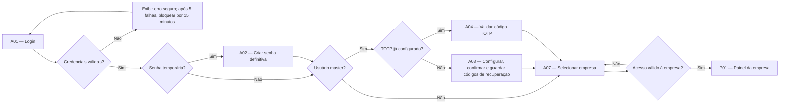

**Regras da passagem:**

- Senha temporária expira em 24 horas;
- Recuperação usa link de e-mail válido por 30 minutos e de uso único;
- Cinco tentativas inválidas bloqueiam a autenticação por 15 minutos;
- Senha definitiva tem no mínimo dez caracteres;
- O TOTP dos masters pode ser fornecido por Google Authenticator ou outro aplicativo compatível;
- O código TOTP não é enviado por e-mail;
- Não existe opção `Manter conectado`;
- O sistema só carrega os dados empresariais depois da escolha;
- Nenhum resultado informa se um dado existe em outra empresa.

**Cadastro de nova empresa:** em A07, usuário com permissão abre A08, conclui o cadastro e recebe a cópia empresarial do modelo de perfil definido. A nova empresa passa a aparecer no seletor. Usuário sem essa permissão não vê a ação.

## 15.2 Troca de empresa e proteção de abas antigas

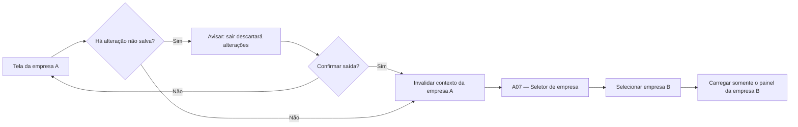

Se uma aba antiga da empresa A tentar buscar ou salvar depois da troca, o servidor não usa o identificador enviado pela aba. A operação falha com segurança e a tela mostra:

> Esta tela foi aberta em outra empresa. Reabra o registro no contexto atual.

O sistema não redireciona automaticamente a aba antiga para um registro de mesmo número na empresa B.

Essa mensagem só é usada quando o sistema comprova que a aba pertence a um contexto anterior da própria sessão. Um identificador arbitrário de outro CNPJ, inclusive por URL manipulada, recebe apenas a resposta genérica de registro não encontrado.

## 15.3 Cadastro de empregado, início sem registro e admissão posterior

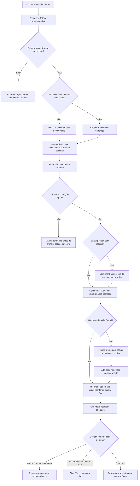

**Como preencher a remuneração:**

- No início sem registro, o usuário confirma a base própria usada para calcular o período sem registro;
- A RA é uma condição independente e pode começar na data de início das atividades, mesmo sem admissão;
- A base do período sem registro não inclui a RA configurada separadamente, evitando pagamento duplicado;
- Quando ocorrer a admissão, o usuário informa o `salário-base oficial` do holerite e mantém ou ajusta a RA vigente; a admissão não cria nem reinicia automaticamente a RA;
- O sistema não decide sozinho como dividir o valor total entre essas duas partes;
- O `total acordado` é calculado e somente leitura: salário-base + RA;
- O período anterior à admissão continua usando sua base confirmada e congelada no recibo;
- A admissão encerra o intervalo sem registro no dia anterior, mas não apaga seus cálculos ou documentos;
- Esse intervalo é dividido em uma linha D30 por competência, sem RA ou complementos;
- Antes de cada pagamento, o usuário confirma que os dias sem registro não estão incluídos no oficial do contador;
- Cada evento efetivamente pago do período sem registro possui recibo próprio;
- Competência fechada ou evento pago nunca é reprocessado silenciosamente: a alteração segue F04.

## 15.4 Jornada mensal da competência

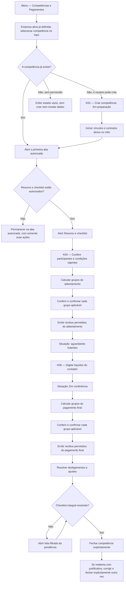

**Pontos essenciais:**

- A visualização é sempre de uma empresa e uma competência;
- A troca da competência recarrega todas as abas do módulo; se houver edição não salva, o sistema pede confirmação antes da troca;
- O menu abre a primeira aba que o usuário tiver autorização para acessar, sem ampliar permissões por causa da unificação visual;
- O adiantamento pode ser confirmado antes da chegada dos holerites;
- O pagamento final só fica pronto quando seus dados necessários estiverem preenchidos;
- Confirmações acontecem antes do fechamento;
- O fechamento não confirma pagamentos e não ocorre automaticamente;
- O dia 15 é inclusivo: no oficial, admissão até o dia 15 pode gerar adiantamento proporcional; a partir do dia 16 não há adiantamento oficial e o final continua sendo exatamente o líquido do contador;
- Para RA, complementos e período sem registro usa-se o início das atividades, e para MEI usa-se o início do contrato; quando o corte impedir a primeira parcela não oficial, o valor devido vai ao pagamento final;
- Empregado e MEI aparecem na mesma visão operacional, porém com identificação e grupos diferentes;
- O divisor comercial D30 é usado nas proporcionalidades aprovadas, inclusive em fevereiro e em meses com 31 dias;
- Valores monetários são gravados com duas casas e cálculo intermediário usa precisão suficiente, com arredondamento monetário apenas ao consolidar o componente;
- Nenhum arredondamento especial para zerar centavos existe.

## 15.5 Cálculo e confirmação independentes por grupo

As transições para `Cancelado por desligamento` no diagrama abaixo existem somente no evento de adiantamento, quando a saída ocorre antes ou na data prevista e o grupo aplicável ainda não foi pago. Pagamento final, desligamento e ajuste não recebem essa transição genérica.

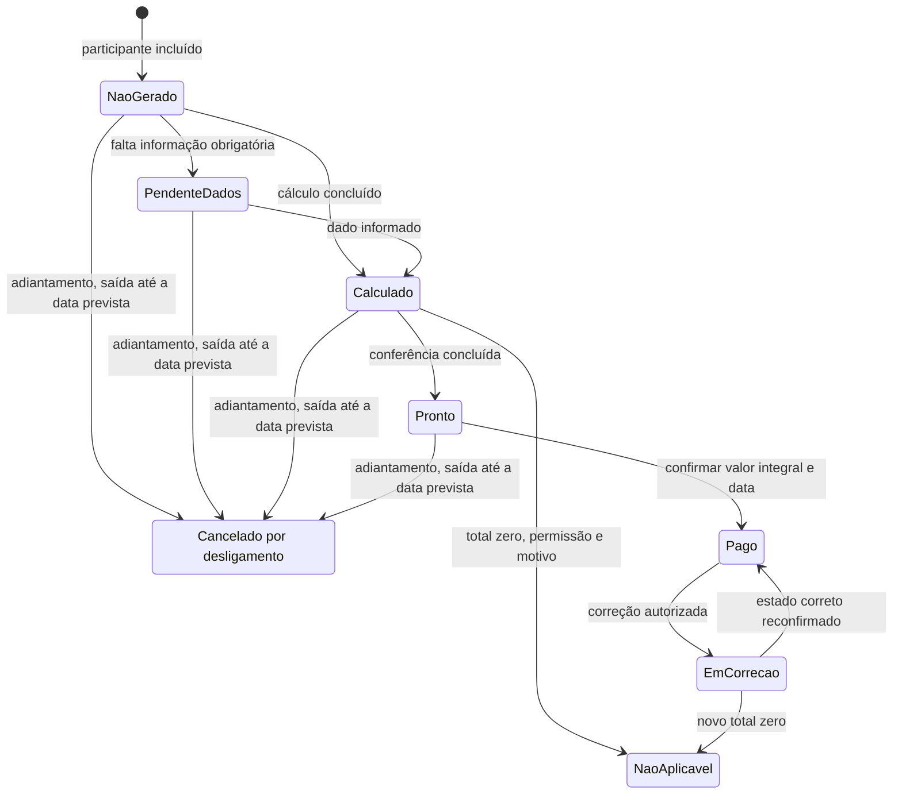

Um participante pode ter, no mesmo evento, o grupo oficial pago e os grupos de RA ou complementos ainda pendentes. A situação geral do participante é derivada da combinação desses estados; ela nunca substitui o estado de cada grupo.

**Exemplo de adiantamento do empregado:**

- `Oficial do empregado`: confirmado em uma data;
- `RA e reembolso`: confirmado separadamente, com recibo próprio;
- `Complementos`: confirmado separadamente, com outro recibo;
- `Período sem registro`: confirmado separadamente e com recibo próprio.

Essa separação não significa parcelamento interno de um grupo. Dentro de cada linha participante + grupo + evento, o pagamento é integral.

## 15.6 Entrada, cálculo e pagamento por participante

1. K04 mostra quem está pendente e por quê;
2. K05 apresenta a memória de cada componente;
3. Um valor automático somente pode ser substituído por usuário autorizado e antes da confirmação;
4. Em RA, complemento ou MEI, eventual saldo deduz somente valor efetivamente pago da mesma verba; excedente vira diferença absorvida;
5. O líquido oficial não participa dessa recomposição e permanece exatamente como veio do contador;
6. F02 impede confirmação quando falta dado, existe conflito, o valor é zero ou há correção aberta;
7. F03 pode confirmar vários participantes, desde que pertençam ao mesmo grupo e evento;
8. O usuário informa a data efetiva — ela pode ser diferente da prevista;
9. O sistema grava cada confirmação individualmente;
10. O recibo definitivo permitido nasce da confirmação, não do fechamento da competência;
11. O painel e o checklist são atualizados depois do sucesso;
12. Registros impedidos são retirados antes da confirmação; diante de falha técnica, a tela consulta o estado real antes de permitir nova tentativa.

## 15.7 Correção depois de pagamento realizado

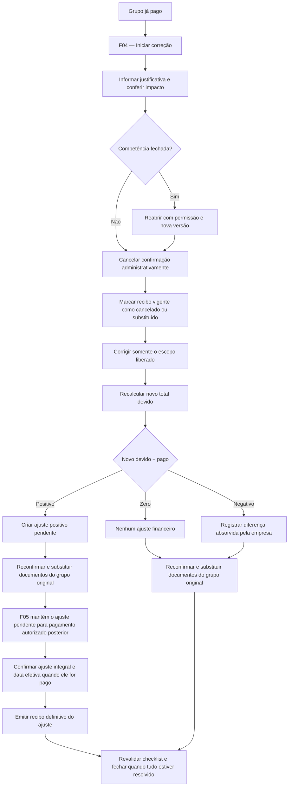

O cancelamento é administrativo: não afirma que o dinheiro deixou de ser pago. O valor efetivamente transferido permanece no histórico e participa da diferença. Nenhuma versão é apagada e um recibo substituto recebe outro número.

Criar o ajuste positivo não o paga. A correção do grupo original pode ser concluída pelo usuário autorizado, enquanto o ajuste permanece em F05 até que outro usuário, se for o caso, possua permissão para confirmar seu pagamento. A competência não fecha enquanto esse ajuste continuar pendente.

## 15.8 Desligamento formal ou sem registro

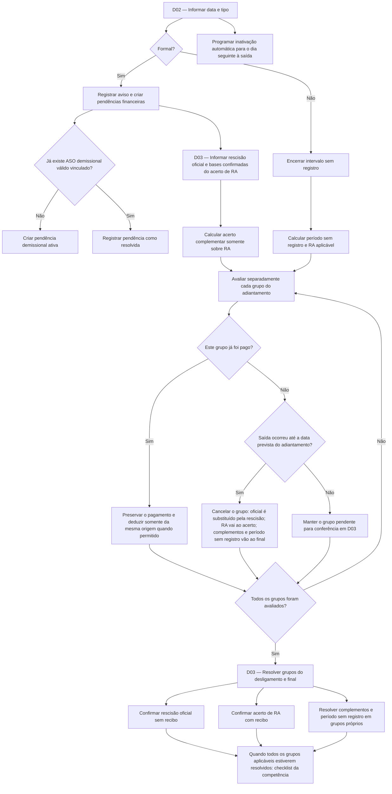

**Regras contra duplicidade:**

- Na demissão formal, o líquido da rescisão oficial substitui o líquido mensal oficial;
- RA mensal integral não é gerada na competência final;
- O saldo proporcional da RA aparece exclusivamente no acerto complementar;
- Se a RA do adiantamento já foi paga, somente essa RA efetivamente paga é deduzida do acerto de RA;
- Salário oficial, complementos, reembolso e período sem registro não são deduzidos do acerto de RA;
- Complementos permanecem integrais no grupo mensal e não entram nos cálculos de 13º, férias ou aviso;
- O salário redondo não gera reembolso no acerto complementar;
- Desligamento sem registro não cria rescisão oficial nem ASO demissional;
- A pendência de ASO demissional não bloqueia o pagamento financeiro.

## 15.9 MEI: contrato, competência e renovação

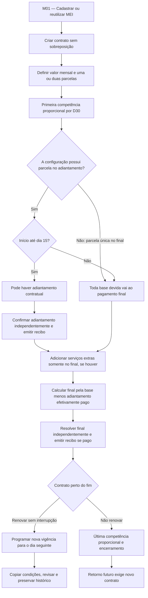

```text
Pagamento final MEI =
base devida − adiantamento efetivamente pago + serviços adicionais
```

- Início e fim na mesma competência formam um único intervalo D30;
- Encerramento antes ou na data prevista do adiantamento ainda não pago leva toda a base proporcional ao final;
- Se o adiantamento pago superar a base final, o final fica zero e o excedente é absorvido;
- Renovação contínua não exige esperar o contrato acabar e não reaplica o corte do dia 15;
- Mudança de valor em renovação no meio do mês divide a competência entre as duas vigências por D30, sem sobreposição e com no máximo 30 dias;
- Serviço adicional é avulso, integral, restrito à competência e ao final; criado depois do final pago, gera ajuste positivo.

## 15.10 ASO: pendência, agendamento e conclusão

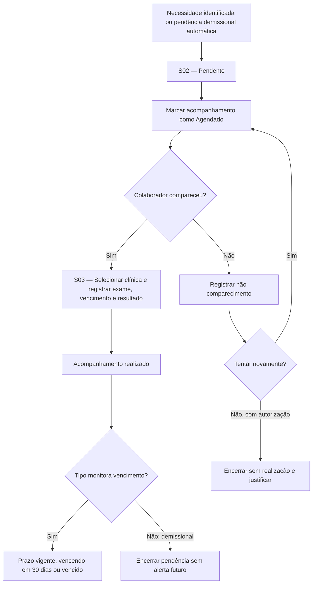

Um periódico realizado é um novo exame. Corrigir um dado do mesmo exame cria nova versão. `Não compareceu` e `Encerrado sem realização` não criam resultado clínico nem ASO fictício.

## 15.11 Exportação, histórico e auditoria

1. O usuário filtra a lista operacional;
2. `Exportar Excel` aparece somente com permissão específica;
3. O sistema resume o escopo — empresa ativa ou global —, filtros, colunas autorizadas e quantidade estimada;
4. Se nenhum registro corresponder, a exportação é recusada e a tela orienta a ajustar a pesquisa;
5. O pedido registra a versão da competência, quando financeira;
6. A geração omite campos ocultos, conserva mascaramento e neutraliza texto que poderia ser executado como fórmula;
7. Exportação operacional comum é gerada diretamente; somente auditoria extensa pode ficar em processamento;
8. O arquivo ou seu andamento aparece somente na tela de origem;
9. No download empresarial, sessão, solicitante, empresa ativa e permissões empresariais são conferidos novamente; no download global, sessão, solicitante e permissão global são revalidados;
10. O arquivo expira em 24 horas e é exclusivo do solicitante;
11. Pedido, conclusão, falha e download geram auditoria;
12. O histórico contextual do empregado, MEI, ASO, competência ou recibo é apenas um filtro da mesma fonte imutável usada por H01 e H02.

## 15.12 Implantação e competência de corte

1. Cadastrar as três empresas, seus logos e padrões;
2. Ativar e testar pelo menos dois masters;
3. Criar modelos, perfis e usuários;
4. Cadastrar manualmente empregados ativos, MEIs, contratos e condições vigentes;
5. Cadastrar complementos recorrentes ainda vigentes, clínicas e somente o último ASO necessário ao controle atual;
6. Definir a competência inicial de cada empresa;
7. Não criar competências ou pagamentos anteriores ao corte;
8. Se a primeira competência já tiver pagamentos reais, registrá-los em K07 como saldo inicial auditado;
9. Conferir quantidades e valores contra o controle atual;
10. Testar isolamento, backup, restauração e o exercício de incidente antes da liberação.

Datas históricas necessárias ao vínculo, contrato ou ASO podem anteceder o corte, mas não produzem movimentação financeira retroativa. Não haverá tela de importação em massa na primeira implantação.

## 15.13 Criação de usuário e atribuição de perfil

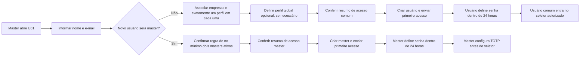

Não há autocadastro. Alterar o perfil ou retirar uma empresa encerra o acesso afetado e passa a valer imediatamente. O usuário não pode alterar o próprio perfil, e-mail, empresas ou condição de master em Minha Conta.

## 15.14 Registro simples de incidente

1. Usuário autorizado abre I01;
2. Registra percepção, descrição objetiva e possível alcance;
3. O responsável documenta contenção e preservação de evidências;
4. Empresas, usuários e dados realmente afetados são confirmados sem ampliar o acesso do registrador;
5. Correção ou restauração é vinculada à linha do tempo;
6. Obrigações externas são avaliadas pelos responsáveis nominais definidos antes da produção;
7. Decisões, conclusão e melhorias ficam registradas em I02 e na auditoria.

---

# 16. Regras transversais de navegação, segurança e experiência

## 16.1 Regra para exibir ações

| Condição | Comportamento da interface |
|---|---|
| Usuário não possui permissão para conhecer a ação | A ação não é exibida. |
| Usuário possui permissão, mas o estado atual impede a ação | A ação fica desabilitada com explicação objetiva. |
| Ação exige justificativa | Abrir etapa de justificativa antes da confirmação final. |
| Ação é irreversível operacionalmente ou substitui documento | Mostrar resumo do impacto e exigir confirmação explícita. |
| Operação está em andamento | Desabilitar repetição e mostrar progresso. |

Ocultar um botão não é medida de segurança suficiente. Todas as decisões são repetidas no servidor e, quando possível, protegidas também por regras do banco.

## 16.2 Permissões por campo

| Estado | Formulário | Lista | Exportação | Auditoria |
|---|---|---|---|---|
| Oculto | Campo inexistente na resposta e na tela | Coluna ausente | Coluna omitida | Valores antes/depois ocultos |
| Mascarado | Valor parcialmente oculto | Valor mascarado | Permanece mascarado | Permanece mascarado |
| Visível sem edição | Campo somente leitura | Coluna visível | Valor autorizado | Visível se também houver permissão de histórico |
| Visível com edição | Editável quando o estado permitir | Coluna visível | Valor autorizado | Visível se também houver permissão de histórico |

Totais e indicadores derivados também são ocultados quando permitiriam deduzir um campo restrito.

## 16.3 Sessão e segurança da conta

- Aviso de inatividade aos 25 minutos;
- Expiração por inatividade aos 30 minutos;
- Duração máxima de oito horas, mesmo com atividade;
- Sem opção de manter conectado;
- Atualizações automáticas do painel não renovam a sessão;
- Trocar de empresa não renova nem amplia a sessão;
- Troca de senha, bloqueio, inativação, mudança de perfil ou revogação encerra os acessos afetados;
- Após expiração, os dados da tela são limpos; formulários não salvos não são armazenados nem reapresentados e nenhuma ação é reenviada automaticamente após novo login;
- Downloads privados exigem sessão válida no momento do clique;
- Masters passam por TOTP depois da senha;
- Um master não pode remover sua proteção TOTP sem um fluxo de recuperação válido;
- Segredo TOTP e códigos de recuperação nunca aparecem em auditoria ou logs.

## 16.4 Confirmações críticas

Exigem resumo de impacto e confirmação explícita:

- Trocar de empresa com edição não salva;
- Fechar ou reabrir competência;
- Confirmar ou cancelar pagamento;
- Marcar grupo como não aplicável;
- Substituir cálculo automático;
- Registrar ou cancelar desligamento;
- Encerrar pendência demissional sem realização;
- Inativar clínica;
- Alterar perfil utilizado por usuários;
- Promover ou rebaixar master;
- Cancelar ou substituir recibo.

## 16.5 Navegação que preserva contexto

- Voltar de um detalhe restaura página, filtros e ordenação da lista;
- Abrir origem de uma notificação preserva um caminho de retorno à central;
- Abrir participante a partir da competência mantém empresa, competência, evento e grupo;
- Abrir recibo e retornar preserva a seleção anterior;
- Links copiados só funcionam se a sessão ainda tiver a empresa e a permissão corretas;
- A competência selecionada fica destacada em toda tela financeira;
- Datas previstas e datas efetivas usam rótulos diferentes e nunca aparecem em uma única coluna ambígua.

Rotas internas de pagamento, desligamento e recibo continuam protegidas mesmo sem item próprio no menu. Acesso direto exige empresa ativa, tela, ação e campos autorizados. Uma rota de exportações centralizada não existe e responde como indisponível, sem revelar pedidos, filtros, nomes ou arquivos.

## 16.6 Formulários extensos

- Separação em blocos lógicos;
- Resumo de erros no topo e erro ao lado do campo;
- Foco no primeiro campo inválido;
- Dados já preenchidos preservados quando uma validação falha;
- Busca de CEP é sugestão e nunca impede preenchimento manual;
- Campos condicionais só aparecem após a escolha que os torna aplicáveis;
- Valores calculados mostram memória e origem;
- Valores substituídos exibem simultaneamente original, manual e diferença;
- Saída com alteração não salva sempre pede confirmação.

## 16.7 Concorrência e repetição segura

- Cada edição usa a versão do registro carregado;
- Salvamento com versão antiga é bloqueado e nunca sobrescreve a alteração mais recente;
- Operações críticas usam uma chave de repetição segura;
- Confirmação financeira, numeração de recibo e fechamento são transacionais;
- Operação e auditoria são concluídas juntas ou nenhuma delas é concluída;
- Ao perder conexão depois de clicar, a tela consulta o resultado antes de oferecer nova tentativa;
- Criação simultânea respeita as unicidades de CPF, CNPJ, vínculo, competência e numeração.

## 16.8 Estados seguros de erro

| Situação | Resposta esperada |
|---|---|
| Sem permissão | Explicar que o perfil não permite a ação, sem expor conteúdo restrito. |
| Aba reconhecida de contexto anterior | Limpar o conteúdo e orientar a reabrir a tela na empresa atual. |
| Identificador arbitrário de outra empresa | Responder apenas como não encontrado, sem orientação que confirme a existência. |
| Sessão expirada | Pedir nova autenticação, sem concluir a ação pendente. |
| Conflito de versão | Bloquear salvamento e pedir atualização da tela. |
| Falha ao gravar auditoria | Reverter a operação inteira. |
| Falha na geração de arquivo | Manter dados financeiros e confirmação intactos; permitir nova geração controlada. |
| Falha externa na busca de CEP | Permitir digitação manual. |
| Falha técnica desconhecida | Mensagem segura com referência de atendimento, sem detalhes internos. |

## 16.9 Acessibilidade e clareza

- Navegação completa por teclado nos formulários e na entrada rápida;
- Foco visível;
- Rótulo textual além de cor e ícone;
- Contraste adequado;
- Mensagens associadas aos campos;
- Tabelas com cabeçalhos claros;
- Confirmações lidas por tecnologia assistiva;
- Valores e datas em padrão brasileiro;
- CPF e CNPJ preservados como texto, inclusive em Excel;
- Linguagem do negócio: `adiantamento`, `pagamento final`, `remuneração adicional`, `complemento` e `líquido do contador`.

---

# 17. Critérios de aceite dos fluxos

## 17.1 Acesso e multiempresa

- [ ] Usuário comum entra com senha e vê somente empresas autorizadas;
- [ ] Master novo configura o TOTP e master já configurado valida o código antes do seletor;
- [ ] Outro master pode iniciar recuperação de TOTP com reautenticação, justificativa, revogação de sessões e auditoria, sem ver o novo segredo;
- [ ] Selecionar uma empresa não carrega registros das demais;
- [ ] Trocar empresa limpa o contexto anterior;
- [ ] Aba antiga não consegue ler ou alterar a empresa anterior depois da troca;
- [ ] Acesso direto por URL é validado no servidor e não revela registro de outro CNPJ;
- [ ] Cadastro de empresa só aparece com permissão e copia o modelo de perfil aprovado;
- [ ] Empresa inativa abre somente em modo histórico e bloqueia novas operações;
- [ ] Existem sempre pelo menos dois masters ativos.

## 17.2 Perfis e campos

- [ ] Perfil controla tela, ação e campo;
- [ ] Perfil empresarial é administrado no contexto de uma única empresa;
- [ ] Usuário comum possui exatamente um perfil em cada empresa associada e perfil global opcional separado;
- [ ] Os quatro estados de campo funcionam em tela, resposta, exportação e auditoria;
- [ ] Alteração do perfil tem efeito imediato;
- [ ] Dependências entre visualizar, editar, exportar, baixar e ações específicas são aplicadas;
- [ ] Novos módulos, ações e campos entram negados por padrão;
- [ ] Mudança crítica de perfil exige justificativa e mostra usuários afetados;
- [ ] Modelo global alterado não modifica perfis empresariais já copiados;
- [ ] Campo oculto não pode ser inferido por total, mensagem, pesquisa ou exportação;
- [ ] Servidor rejeita tentativa direta de editar campo somente leitura.

## 17.3 Colaboradores e vínculos

- [ ] CPF duplicado na empresa não cria outra pessoa;
- [ ] Vínculo ativo ou sobreposto impede nova contratação;
- [ ] Recontratação reutiliza a pessoa e cria vínculo separado;
- [ ] Início das atividades, admissão, desligamento sem registro e demissão formal permanecem datas distintas;
- [ ] Salário-base e RA são editáveis conforme permissão; total acordado é derivado e somente leitura;
- [ ] Período sem registro termina no dia anterior à admissão, não inclui RA ou complemento e exige confirmação antes do pagamento;
- [ ] Histórico dentro do colaborador reflete a auditoria única;
- [ ] Inativação ocorre no dia seguinte à saída sem esconder a última competência.

## 17.4 Competência e pagamentos

- [ ] Competência é única por empresa e mês;
- [ ] Participantes são incluídos sem duplicação;
- [ ] Dia 15 recebe corte inclusivo e dia 16 não recebe adiantamento inicial;
- [ ] D30 resulta em 16 dias do dia 15 ao fim, 15 dias do dia 16 ao fim e um dia quando início e fim coincidem;
- [ ] Em D30, dia 31 e último dia de fevereiro equivalem ao dia comercial 30, e o mês completo resulta em 30 dias;
- [ ] Líquido do contador é digitado individualmente e não é recalculado;
- [ ] O sistema não desconta novamente o adiantamento do líquido;
- [ ] Primeira RA é proporcional, competências intermediárias são integrais e alteração no mês vale para a competência inteira;
- [ ] Complemento é integral e nunca sofre proporcionalidade diária;
- [ ] Saldo de RA, complemento ou MEI deduz apenas pagamento efetivo da mesma verba; excedente é absorvido;
- [ ] Salário redondo exige valor real ou confirmação de zero em cada evento antes do fechamento;
- [ ] Grupos são calculados, conferidos e confirmados separadamente;
- [ ] Não existe pagamento parcial dentro do mesmo grupo e evento;
- [ ] Confirmação exige data efetiva e é idempotente;
- [ ] Valor zero usa `Não aplicável`, com motivo e permissão;
- [ ] Competência só fecha depois que todo o checklist estiver resolvido;
- [ ] Atualizar participante em competência fechada direciona à correção e não reprocessa silenciosamente;
- [ ] Reabertura exige permissão, justificativa e nova versão.

## 17.5 Correções, desligamentos e documentos

- [ ] Pagamento real permanece preservado durante uma correção;
- [ ] Diferença positiva cria ajuste; diferença negativa é absorvida e não cobrada;
- [ ] Recibo cancelado ou substituído continua consultável;
- [ ] Recibo definitivo só nasce depois do pagamento confirmado;
- [ ] Salário oficial, líquido do holerite e rescisão oficial não geram recibo interno;
- [ ] Demissão formal substitui o líquido mensal pela rescisão oficial;
- [ ] Saldo da RA não aparece simultaneamente no mensal e no acerto;
- [ ] Acerto calcula somente RA vigente e deduz somente RA do adiantamento já paga;
- [ ] Acerto mostra D30, aviso indenizado, 13º, férias, terços e férias vencidas sem dobra, conforme aplicabilidade confirmada;
- [ ] Aviso trabalhado não gera linha adicional no acerto;
- [ ] Complementos não entram no acerto complementar;
- [ ] Desligamento sem registro não gera rescisão oficial nem ASO demissional.

## 17.6 MEI e ASO

- [ ] CNPJ MEI é reutilizado na mesma empresa sem sobrepor contratos;
- [ ] Primeiro e último mês do contrato são proporcionais por D30;
- [ ] Início do MEI a partir do dia 16 migra a primeira parcela para o final;
- [ ] Adiantamento e final do MEI são confirmados separadamente, e o final deduz somente o adiantamento efetivamente pago;
- [ ] Encerramento antes do adiantamento não pago leva toda a base ao final; excesso já pago vira diferença absorvida;
- [ ] Renovação com valor novo no meio do mês divide vigências por D30, sem sobreposição ou mais de 30 dias;
- [ ] Serviço adicional existe somente na competência e no pagamento final;
- [ ] Serviço adicional criado depois do final pago gera ajuste positivo;
- [ ] Renovação contínua começa no dia seguinte, preserva histórico e não reaplica o corte;
- [ ] ASO armazena somente os dados informativos aprovados;
- [ ] `Não compareceu` não é resultado clínico;
- [ ] Periódico novo não sobrescreve exame anterior;
- [ ] Retificação mantém todas as versões;
- [ ] Acompanhamento, resultado, prazo e restrição são estados separados; `Sem restrição`/`Com restrição` só aparecem com permissão do resultado clínico;
- [ ] Pendência demissional persiste até realização ou encerramento autorizado;
- [ ] Só o periódico mais recente alerta; versão substituída e vínculo inativo não criam novo alerta;
- [ ] Demissional não gera vencimento futuro e encerramento sem realização não é dispensa nem exame.

## 17.7 Segurança, auditoria e desempenho

- [ ] Tentativa cruzada entre empresas não revela existência do registro;
- [ ] Link de recuperação de senha é de uso único e expira em 30 minutos;
- [ ] Sessão avisa aos 25 minutos, expira aos 30 e termina no máximo após 8 horas;
- [ ] Não existe `Manter conectado`, e atualização automática ou troca de empresa não prolonga a sessão;
- [ ] Troca de senha e redefinição de TOTP revogam as sessões aplicáveis;
- [ ] Auditoria obrigatória falhando reverte a alteração de negócio;
- [ ] Auditoria é somente de acréscimo, redige valores pelas permissões atuais e nunca contém segredos;
- [ ] Abertura de resultado sensível de ASO é auditada;
- [ ] Arquivo Excel é privado, por empresa, do solicitante e expira em 24 horas;
- [ ] Excel vazio não é gerado e textos são neutralizados contra execução como fórmula;
- [ ] PDF é privado, imutável, possui hash e revalida sessão, empresa e permissão no download;
- [ ] Emissão, download, cancelamento e substituição de PDF são auditados;
- [ ] Operações críticas não duplicam em clique repetido;
- [ ] Edição concorrente antiga é bloqueada;
- [ ] Listas paginam e não carregam inativos por padrão;
- [ ] Metas do Documento Mestre são medidas em homologação com volume representativo.

## 17.8 Navegação simplificada

- [ ] Menu lateral apresenta `Painel`, `Colaboradores`, `Competências e Pagamentos`, `ASO`, `Notificações` e `Auditoria` conforme permissão;
- [ ] Existe um único item `Competências e Pagamentos`, mas permissões de visualizar, calcular, confirmar, cancelar, corrigir, reabrir e baixar continuam independentes;
- [ ] Usuário com acesso parcial vê somente as abas, cartões, totais e ações autorizados;
- [ ] Trocar competência recarrega todas as abas e pede confirmação quando houver edição não salva;
- [ ] D01–D03 não aparecem no menu, mas continuam acessíveis por Colaboradores, painel, competência e notificações autorizadas;
- [ ] R01–R03 não aparecem no menu, mas continuam acessíveis pela competência e pelo participante;
- [ ] N01 permanece no menu e no sino sem revelar contagens ou itens não autorizados;
- [ ] Não existe tela, item de menu ou permissão de central de exportações;
- [ ] Colaboradores, competência, ASO, clínicas e auditoria exportam nas próprias telas;
- [ ] Links contextuais selecionam a competência correta somente dentro da empresa ativa; destino de outro CNPJ retorna ao seletor e exige escolha explícita antes de nova validação;
- [ ] Remover um item do menu não reduz as verificações de segurança da rota;
- [ ] Troca de empresa invalida abas, exportações e downloads do contexto anterior.

---

# 18. Ordem recomendada para os protótipos

Após a aprovação deste documento, a próxima etapa será criar protótipos de baixa fidelidade nesta ordem:

| Lote | Telas | Motivo |
|---:|---|---|
| 1 | A01 a A10, P01 e estrutura global | Valida autenticação, TOTP, recuperação, conta, contexto de empresa e navegação principal. |
| 2 | C01 a C08 e M01 a M06 | Valida cadastro, vínculo, condições financeiras, separação empregado/MEI e abas contextuais. |
| 3 | Estrutura unificada, K01 a K07 e F01 a F03 | Valida o seletor, as abas, o coração operacional mensal e a competência de corte. |
| 4 | F04, F05 e R01 a R03 dentro da competência | Valida correção, ajustes, confirmação independente e documentos sem novo item de menu. |
| 5 | D01 a D03 dentro de Colaboradores e da competência | Valida saída, competência final e ligação entre cadastro e acerto financeiro. |
| 6 | S01 a S06 | Valida acompanhamento, exame, versões e clínica compartilhada. |
| 7 | N01, H01 a H03, U01 a U05 e I01 a I02 | Fecha notificações, administração, segurança e rastreabilidade; exportações são variações das telas de origem. |

Cada lote seguirá o mesmo ciclo:

1. Wireframe da tela e navegação;
2. Revisão do usuário;
3. Ajustes;
4. Aprovação explícita;
5. Protótipo de maior fidelidade apenas quando necessário;
6. Registro da versão aprovada para orientar desenvolvimento e testes.

C06–C08 e M05–M06 serão prototipadas no Lote 2 como entradas contextuais; seus componentes completos de ASO, recibo e auditoria serão validados novamente nos Lotes 4, 6 e 7.

---

# 19. Situação desta etapa

Este documento transforma o planejamento aprovado em arquitetura de navegação, inventário de telas, fluxos operacionais e critérios de aceite. Ele não altera as regras do Documento Mestre e não inicia desenvolvimento.

**Situação:** aprovado pelo usuário em 15/08/2026.

**Evolução posterior:** Lotes 1 a 7 aprovados pelo usuário. Eles estão documentados em `09-prototipos-baixa-fidelidade-lote-1.md`, `10-prototipos-baixa-fidelidade-lote-2.md`, `11-prototipos-baixa-fidelidade-lote-3.md`, `12-prototipos-baixa-fidelidade-lote-4.md`, `13-prototipos-baixa-fidelidade-lote-5.md`, `14-prototipos-baixa-fidelidade-lote-6.md` e `15-prototipos-baixa-fidelidade-lote-7.md`. O Lote 7 — notificações, auditoria, administração, segurança e incidentes — foi aprovado integralmente em 21/08/2026. A melhoria futura `MF-01 — Agendamento de ASO e lembretes ao colaborador` permanece registrada sem ampliar a primeira versão. A consolidação final do `16-consolidacao-final-prototipos.md` foi aprovada integralmente em 21/08/2026 e autorizou a elaboração do Documento 17 — Matriz Formal de Estados e Transições.
