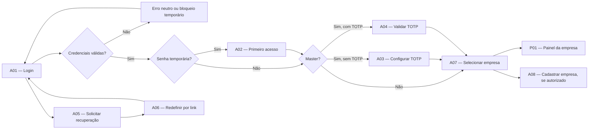

# Sistema Web de Departamento Pessoal

## Protótipos de Baixa Fidelidade — Lote 1

**Versão:** 1.0 — aprovada pelo usuário em 16/08/2026  
**Data:** 15/08/2026  
**Etapa:** primeiro lote de protótipos, posterior à aprovação dos fluxos integrados  
**Fontes oficiais:** `07-documento-mestre-planejamento-funcional.md` e `08-fluxos-integrados-navegacao-telas.md`  

> Este documento valida organização, conteúdo, navegação, permissões e estados das telas. Cores, identidade visual, ilustrações, medidas exatas e acabamento ainda não são definitivos.

---

# 1. Objetivo do lote

Validar, antes do desenvolvimento:

- Entrada segura no sistema;
- Primeiro acesso e recuperação de senha;
- Segundo fator obrigatório para master;
- Seleção de uma única empresa;
- Cadastro autorizado de empresa no seletor;
- Segurança da própria conta;
- Configuração da empresa ativa;
- Estrutura global da interface autenticada;
- Painel inicial da empresa;
- Estados de validação, processamento, sessão e falta de acesso.

---

# 2. Telas incluídas

| Código | Tela |
|---|---|
| A01 | Login |
| A02 | Primeiro acesso |
| A03 | Configuração inicial do TOTP |
| A04 | Validação TOTP |
| A05 | Solicitar recuperação de senha |
| A06 | Redefinir senha |
| A07 | Seleção de empresa |
| A08 | Cadastro de empresa |
| A09 | Minha Conta |
| A10 | Configurações da empresa ativa |
| P01 | Painel da empresa |
| Compartilhado | Cabeçalho, menu, avisos de sessão, carregamento e erros seguros |

Não fazem parte deste lote:

- Cadastro de colaboradores ou MEI;
- Cálculos e confirmações financeiras;
- Desligamentos;
- Recibos;
- ASO e clínicas em detalhe;
- Usuários, perfis e matriz de permissões;
- Auditoria e incidentes em detalhe.

Esses módulos aparecem apenas como destinos no menu ou nos cartões, sem prototipar sua tela interna agora.

---

# 3. Convenções do protótipo

1. Dados apresentados são fictícios e servem apenas para visualizar a organização;
2. Caixas representam agrupamentos, não o acabamento visual definitivo;
3. Botão ausente significa ação sem permissão;
4. Botão desabilitado significa ação conhecida, mas impedida pelo estado atual;
5. Mensagens de erro aparecem próximas do campo e, quando necessário, também no topo;
6. Operação em processamento bloqueia repetição;
7. Empresa ativa, CNPJ e competência permanecem visíveis quando aplicáveis;
8. Nenhuma tela operacional oferece seletor de várias empresas;
9. Alterar empresa sempre retorna a A07;
10. Painel apenas resume e direciona; não confirma nem resolve operações.
11. Os seletores `Tela para revisar`, `Estado da tela` e `Cenário simulado do acesso` pertencem somente ao protótipo e não farão parte do produto.

---

# 4. Fluxo de acesso



Regras visíveis no fluxo:

- Não existe autocadastro;
- Usuário comum não passa pelo TOTP obrigatório;
- Master não chega ao seletor sem concluir o TOTP;
- Nenhum dado empresarial é carregado antes de A07;
- Link ou endereço direto não permite pular uma etapa;
- Recuperação de senha não revela se o e-mail existe.

---

# 5. Estruturas-base

## 5.1 Estrutura das telas de acesso A01 a A06

```text
┌──────────────────────────────────────────────────────┐
│ Logo  Portal de Departamento Pessoal                 │
│                                                      │
│ Título da etapa                                      │
│ Orientação curta                                     │
│                                                      │
│ [ Campo ]                                            │
│ [ Campo condicional ]                                │
│ [ Mensagem de validação ou segurança ]               │
│                                                      │
│ [ Ação principal ]                                   │
│ Ação secundária                                      │
└──────────────────────────────────────────────────────┘
```

Características:

- Um único bloco central;
- Sem menu lateral;
- Sem empresa, CNPJ, competência, notificações ou dados operacionais;
- Foco inicial no primeiro campo;
- Navegação completa por teclado;
- Senha nunca volta preenchida depois de falha.

## 5.2 Estrutura sem empresa ativa

Usada em A07, A08 e A09 quando Minha Conta for aberta antes da seleção de empresa:

```text
┌──────────────────────────────────────────────────────┐
│ Escopo global            Minha Conta           Sair │
├──────────────────────────────────────────────────────┤
│ Conteúdo sem dados de uma empresa específica         │
└──────────────────────────────────────────────────────┘
```

O marcador `Escopo global` evita confundir o cadastro de uma empresa com uma edição do CNPJ anteriormente acessado.

## 5.3 Estrutura da empresa ativa

Usada em A09 quando aberta pela área empresarial, em A10, P01 e nas telas operacionais futuras:

```text
┌───────────────────┬────────────────────────────────────────────┐
│ Departamento      │ Logo  Empresa  CNPJ                        │
│ Pessoal           │ Notificações  Usuário  Trocar empresa Sair │
│                   ├────────────────────────────────────────────┤
│ Painel            │ Conteúdo da tela                           │
│ Colaboradores     │                                            │
│ Competências e    │                                            │
│ Pagamentos        │                                            │
│ ASO               │                                            │
│ Notificações      │                                            │
│ Auditoria*        │                                            │
└───────────────────┴────────────────────────────────────────────┘

* Somente quando autorizado.
```

Regras:

- Menu mostra apenas itens autorizados;
- Sino conta apenas notificações que o usuário pode conhecer;
- Clicar no nome abre A09;
- A09 herda a estrutura e o retorno da tela de origem: A07 mantém escopo global; uma tela empresarial mantém a empresa ativa;
- `Trocar empresa` volta para A07 e limpa o contexto anterior;
- Empresa inativa acrescenta faixa persistente `Modo histórico`;
- Em tela estreita, o menu reorganiza sem esconder o nome da empresa ou o CNPJ.

---

# 6. A01 — Login

## 6.1 Conteúdo

- E-mail;
- Senha;
- `Entrar`;
- `Esqueci minha senha`.

Não incluir:

- `Manter conectado`;
- Cadastro de usuário;
- Empresa ou CNPJ;
- Informação de que o usuário é master;
- Motivo específico de falha.

## 6.2 Estados

| Estado | Apresentação |
|---|---|
| Normal | Campos vazios e ação Entrar. |
| Credencial não aceita | `Não foi possível entrar com os dados informados.` |
| Quinta falha | Informar bloqueio temporário de 15 minutos sem revelar a causa cadastral. |
| Processando | Entrar desabilitado e indicação de andamento. |
| Sessão expirada | Mensagem neutra e retorno ao formulário limpo. |

## 6.3 Saídas

- A02, quando a senha for temporária;
- A03 ou A04, quando o usuário for master;
- A07, quando for usuário comum;
- A05, pelo link de recuperação.

---

# 7. A02 — Primeiro acesso

## 7.1 Conteúdo

- Nova senha;
- Confirmar nova senha;
- Orientação `Mínimo de 10 caracteres`;
- `Definir senha`.

## 7.2 Estados

- Senhas divergentes;
- Senha fora da política;
- Senha temporária vencida após 24 horas;
- Processamento;
- Sucesso e invalidação da senha temporária.

## 7.3 Navegação

- Master segue para A03 ou A04;
- Usuário comum segue para A07;
- A etapa não pode ser ignorada por endereço direto.

---

# 8. A03 — Configuração inicial do TOTP

## 8.1 Organização proposta

- QR Code à esquerda em tela larga;
- Chave alternativa, código e confirmação à direita;
- Em tela estreita, QR Code fica acima dos campos;
- Depois do sucesso, substituir a configuração pela lista de códigos de recuperação.

## 8.2 Conteúdo

- QR Code;
- Chave de configuração alternativa;
- Código de seis dígitos;
- `Confirmar configuração`;
- Códigos de recuperação exibidos somente uma vez depois do sucesso;
- `Já guardei os códigos`.

## 8.3 Regras

- Somente master;
- Compatível com Google Authenticator e equivalentes;
- Cada código de recuperação é de uso único;
- Segredo e códigos nunca aparecem em histórico ou logs;
- O seletor não abre antes da confirmação.

---

# 9. A04 — Validação TOTP

## 9.1 Conteúdo

- Código atual do aplicativo;
- `Validar código`;
- Alternância `Usar código de recuperação`;
- Retorno para o modo do aplicativo.

## 9.2 Estados

- Código inválido;
- Código de recuperação já utilizado;
- Processamento;
- Sucesso.

O código TOTP não é enviado por e-mail.

---

# 10. A05 — Solicitar recuperação

## 10.1 Conteúdo

- E-mail;
- `Enviar instruções`;
- `Voltar ao login`.

## 10.2 Resposta segura

Depois do envio, sempre mostrar:

> Se existir uma conta para este e-mail, você receberá as instruções de recuperação.

A resposta não informa nome, situação, bloqueio, existência da conta ou empresas associadas.

---

# 11. A06 — Redefinir senha

## 11.1 Conteúdo

- Nova senha;
- Confirmar nova senha;
- `Redefinir senha`;
- `Solicitar novo link`, quando o atual não estiver disponível.

## 11.2 Estados

- Link válido;
- Link inválido, vencido ou já usado, tratados visualmente da mesma forma;
- Senha fora da política;
- Confirmação divergente;
- Processamento;
- Sucesso, consumo do token, revogação de sessões e retorno a A01.

No próximo login, master continua passando pelo TOTP.

---

# 12. A07 — Seleção de empresa

## 12.1 Organização proposta

- Cabeçalho global com Minha Conta e Sair;
- Título e explicação de que apenas uma empresa será carregada;
- `Cadastrar empresa` somente com permissão;
- Grade de cartões das empresas autorizadas;
- Cada cartão mostra logo, nome, CNPJ, situação e `Entrar`.

## 12.2 Estados

| Estado | Comportamento |
|---|---|
| Empresas autorizadas | Mostrar apenas os respectivos cartões. |
| Sem empresa associada | Explicar a ausência sem mostrar outros CNPJs. |
| Carregando | Estrutura neutra, sem dados da empresa anteriormente acessada. |
| Empresa inativa | Ação `Entrar em modo histórico`. |
| Falha | Tentar novamente sem reapresentar dados antigos. |

## 12.3 Regras

- Usuário comum vê somente empresas associadas;
- Master vê todas as empresas atuais e futuras, sem depender de associação empresarial individual;
- Clicar em Entrar estabelece a empresa ativa no servidor;
- Não há painel somado, filtro multiempresa ou carregamento dos três CNPJs;
- Trocar empresa não renova a sessão.

---

# 13. A08 — Cadastro de empresa

## 13.1 Decisão de layout proposta

Usar uma única página com três blocos, e não um assistente de várias etapas:

1. Identificação;
2. Padrões financeiros;
3. Acesso inicial.

Essa opção reduz cliques e mantém todos os dados revisáveis antes de salvar.

## 13.2 Campos

| Bloco | Campos |
|---|---|
| Identificação | Razão social, nome fantasia, CNPJ e logo opcional. |
| Padrões financeiros | Percentual padrão do adiantamento, dia sugerido do adiantamento, dia sugerido do pagamento final e competência inicial. |
| Acesso inicial | Modelo de perfil do criador e situação. |

## 13.3 Ações

- `Salvar e entrar`;
- `Salvar e voltar`;
- `Cancelar`.

## 13.4 Validações e segurança

- Acesso somente com permissão global;
- CNPJ válido e único, com mensagem neutra `Não foi possível usar este CNPJ` quando o valor não puder ser aceito;
- Duplicidade não revela dados nem confirma a existência da empresa cadastrada;
- Logo PNG ou JPEG de até 2 MB, com validação real do conteúdo e remoção de metadados desnecessários;
- Clique repetido não duplica empresa;
- Empresa e cópia do perfil são gravadas juntas;
- Criador comum não recebe gestão de usuários;
- Todos os masters recebem acesso automaticamente à nova empresa.

---

# 14. A09 — Minha Conta

## 14.1 Decisão de layout proposta

Usar quatro abas internas:

1. Dados;
2. Senha;
3. Segundo fator;
4. Sessões.

As abas organizam as ações sem transformar Minha Conta em gestão administrativa de usuários.

A09 usa o contexto da origem:

- Aberta por A07 ou A08: cabeçalho global, sem empresa carregada, e retorno à origem;
- Aberta pela área empresarial: mantém a empresa ativa e retorna à tela empresarial de origem.

## 14.2 Conteúdo e ações

- Nome e e-mail somente leitura;
- Trocar senha informando a atual;
- Configurar TOTP quando aplicável;
- Regenerar códigos após reautenticação;
- Encerrar outras sessões;
- Sair.

## 14.3 Não permitido

- Alterar e-mail;
- Alterar perfil;
- Alterar empresas autorizadas;
- Promover-se ou rebaixar-se de master;
- Remover livremente o TOTP obrigatório do master.

---

# 15. A10 — Configurações da empresa ativa

## 15.1 Conteúdo

- Empresa e CNPJ persistentes no cabeçalho;
- Razão social;
- Nome fantasia;
- CNPJ;
- Logo;
- Percentual padrão do adiantamento;
- Dias sugeridos;
- Competência inicial somente leitura;
- Situação.

## 15.2 Ações

- Salvar alterações permitidas;
- Trocar logo;
- Inativar empresa;
- Voltar.

## 15.3 Bloqueios

- Sem permissão, a rota não mostra dados;
- Competência inicial não pode ser alterada pela edição comum;
- Empresa com competência, pagamento, ajuste ou desligamento pendente não pode ser inativada;
- Empresa nunca é excluída;
- Conflito de edição exige atualização;
- Empresa inativa fica em modo histórico;
- Gravação empresarial e auditoria são concluídas juntas ou ambas são revertidas.

---

# 16. P01 — Painel da empresa

## 16.1 Faixa de contexto

- Logo, nome, CNPJ e situação da empresa;
- Competência selecionada;
- Situação e versão da competência;
- Data e hora da última atualização;
- Atualizar;
- Trocar competência;
- Trocar empresa.

## 16.2 Organização proposta

```text
┌────────────────────────────────────────────────────────────┐
│ Painel       Competência [09/2026]              Atualizar │
│ Última atualização                                         │
├────────────────────────────────────────────────────────────┤
│ Participantes  │ Grupos pendentes │ Grupos pagos           │
├───────────────────────────┬────────────────────────────────┤
│ Colaboradores e contratos │ ASO                            │
│ Contagens e links         │ Contagens e links              │
├───────────────────────────┴────────────────────────────────┤
│ Pendências da competência                                  │
│ Grupo | quantidade | destino filtrado                      │
└────────────────────────────────────────────────────────────┘
```

## 16.3 Colaboradores e contratos

Agrupar em um único bloco:

- Empregados ativos registrados;
- Empregados ativos sem registro;
- Encerramentos programados;
- Empregados inativos;
- MEIs ativos;
- MEIs a iniciar;
- Renovações programadas;
- MEIs próximos do encerramento;
- MEIs encerrados.

Cada linha abre C01 com tipo e situação já filtrados.

## 16.4 Resumo da competência

- Participantes;
- Grupos pendentes;
- Grupos prontos;
- Grupos pagos;
- Grupos não aplicáveis;
- Correções em andamento;
- Ajustes positivos pendentes;
- Diferenças absorvidas, somente quando autorizadas.

## 16.5 Pendências financeiras

Mostrar apenas linhas autorizadas e aplicáveis:

- Adiantamentos;
- Pagamentos finais;
- Líquidos do contador;
- RA e reembolsos;
- Complementos;
- Períodos sem registro;
- Eventos MEI;
- Salários redondos sem valor ou confirmação de zero;
- Rescisões oficiais;
- Acertos de RA;
- Recibos a substituir.

O clique abre `Competências e Pagamentos` na competência, aba, grupo e situação correspondentes. Não existe ação financeira direta no painel.

## 16.6 ASO

- Vencendo em 30 dias;
- Vencidos;
- Demissionais pendentes;
- Não comparecimentos ainda não encerrados.

O painel não mostra resultado, restrição, diagnóstico ou qualquer dado clínico.

## 16.7 Estados especiais

### Sem competência

- Manter empresa e CNPJ;
- Manter indicadores cadastrais e de ASO autorizados;
- Não mostrar zeros financeiros fictícios;
- Mostrar `Nenhuma competência disponível`;
- `Criar competência` somente para quem puder criar.

### Sem pendências

Mostrar `Nenhuma pendência nesta competência`, sem criar indicador `A recuperar`.

### Empresa inativa

- Faixa persistente `Modo histórico — empresa inativa`;
- Consultas históricas autorizadas;
- Sem criação, edição, cálculo, confirmação, correção, reabertura ou nova emissão.

### Conteúdo restrito

- Cartão ou linha sem permissão é omitido;
- Não mostrar zero no lugar de dado oculto;
- Omitir também totais que permitiriam deduzir campo restrito.

---

# 17. Estados transversais

## 17.1 Aviso de sessão

Aos 25 minutos de inatividade:

```text
Sua sessão está prestes a expirar.
[Continuar sessão] [Sair]
```

## 17.2 Sessão expirada

Aos 30 minutos de inatividade ou após 8 horas totais:

```text
Sua sessão expirou. Entre novamente para continuar.
[Ir para o login]
```

Dados sensíveis e formulários não salvos são limpos e nenhuma ação é reenviada automaticamente.

## 17.3 Sem permissão

```text
Seu perfil não permite realizar esta ação nesta empresa.
```

O conteúdo protegido, contagens e existência de registros não aparecem.

## 17.4 Aba da empresa anterior

```text
Esta tela foi aberta em outra empresa.
Reabra o registro no contexto atual.
```

O conteúdo anterior é limpo. A aba não lê, salva, exporta nem baixa.

## 17.5 Rota sem contexto ou identificador cruzado

- Usuário não autenticado retorna a A01 sem receber dados;
- Master parcialmente autenticado permanece em A03 ou A04;
- Usuário autenticado sem empresa ativa retorna a A07;
- Link de outro CNPJ nunca troca a empresa automaticamente;
- Identificador inexistente ou pertencente a outro CNPJ recebe a mesma resposta: `O registro solicitado não foi encontrado.`

## 17.6 Alteração não salva

Antes de trocar empresa, sair da tela ou usar Voltar:

```text
Existem alterações não salvas.
Sair descartará essas alterações.
[Continuar editando] [Descartar e sair]
```

## 17.7 Processamento e falha segura

- Ação em andamento fica desabilitada;
- Duplo clique não cria outra solicitação;
- Falha incerta consulta o resultado antes de permitir nova tentativa;
- Mensagem segura: `Não foi possível registrar a operação com segurança. Nenhuma alteração foi concluída.`

---

# 18. Navegação esperada

| Origem | Ação | Destino |
|---|---|---|
| A01 | Esqueci minha senha | A05 |
| A05 | Voltar | A01 |
| A05 | Link recebido | A06 |
| A06 | Sucesso | A01 |
| A03/A04 | Autenticação concluída | A07 |
| A07 | Entrar em empresa ativa | P01 |
| A07 | Cadastrar empresa | A08 |
| A07 | Minha Conta | A09 |
| A08 | Salvar e entrar | P01 |
| A08 | Salvar e voltar ou cancelar | A07 |
| A09 | Voltar | Tela de origem |
| A10 | Voltar | Tela de origem empresarial |
| P01 | Trocar empresa | A07 |
| P01 | Indicador | Lista de origem já filtrada |

---

# 19. Critérios de aceite do Lote 1

## 19.1 Acesso

- [ ] A01 não mostra nem carrega dados empresariais;
- [ ] Falha de login não revela o motivo;
- [ ] Não existe `Manter conectado`;
- [ ] Senha temporária exige troca e vence em 24 horas;
- [ ] Senha definitiva exige no mínimo 10 caracteres;
- [ ] Master configura ou valida TOTP antes de A07;
- [ ] Usuário comum não é obrigado a usar TOTP;
- [ ] Códigos de recuperação são de uso único;
- [ ] Recuperação de senha usa resposta neutra;
- [ ] Link de recuperação vence em 30 minutos e é consumido no sucesso.

## 19.2 Empresa e contexto

- [ ] A07 mostra somente empresas autorizadas;
- [ ] Apenas uma empresa é carregada;
- [ ] Cadastro de empresa aparece somente com permissão global;
- [ ] A08 identifica `Escopo global`;
- [ ] A10 identifica permanentemente a empresa alterada;
- [ ] Competência inicial não é editada depois da criação;
- [ ] Empresa com pendências não pode ser inativada;
- [ ] Empresa inativa abre somente em modo histórico;
- [ ] Trocar empresa limpa completamente o contexto anterior.
- [ ] Master acessa todas as empresas atuais e futuras sem associação empresarial individual;
- [ ] Link de outro CNPJ retorna ao seletor e exige escolha explícita;
- [ ] Identificador inexistente ou cruzado recebe resposta genérica de não encontrado.

## 19.3 Conta e sessão

- [ ] Minha Conta não permite editar e-mail, perfil, empresas ou condição de master;
- [ ] Regenerar códigos invalida os anteriores;
- [ ] Troca de senha revoga sessões anteriores;
- [ ] Aviso aparece aos 25 minutos de inatividade;
- [ ] Sessão expira aos 30 minutos e no máximo após 8 horas;
- [ ] Atualização do painel ou sino não prolonga a sessão;
- [ ] Aba antiga não reutiliza dados após troca de empresa.

## 19.4 Painel

- [ ] Empresa, CNPJ e competência ficam evidentes;
- [ ] Competência inicial segue a ordem aprovada;
- [ ] Cartão sem permissão é omitido;
- [ ] Totais não permitem inferir campos ocultos;
- [ ] ASO não mostra resultado ou restrição clínica;
- [ ] Cada indicador abre a origem com filtro correto;
- [ ] Nenhuma ação financeira é executada no painel;
- [ ] Sem competência, o painel mantém somente informações não financeiras autorizadas;
- [ ] Empresa inativa permanece integralmente em leitura histórica.

## 19.5 Usabilidade

- [ ] Todas as ações são utilizáveis por teclado;
- [ ] Foco inicial e foco de erro são previsíveis;
- [ ] Mensagens ficam associadas aos campos;
- [ ] Significado não depende apenas de cor;
- [ ] Layout reorganiza em tela estreita sem cortar campos ou ações;
- [ ] Operação em andamento bloqueia repetição;
- [ ] Alteração não salva gera confirmação antes da saída.

## 19.6 Segurança e auditoria

- [ ] Falhas relevantes e bloqueio de login são auditados sem senha ou motivo sensível;
- [ ] Recuperação, troca de senha, configuração e reset de TOTP são auditados sem token, segredo ou código;
- [ ] Revogação e encerramento de sessões ficam registrados;
- [ ] Criação, alteração e inativação de empresa ficam registradas;
- [ ] Tentativas negadas ou cruzadas entre CNPJs ficam registradas sem expor o registro-alvo;
- [ ] Falha da auditoria obrigatória reverte integralmente a alteração empresarial;
- [ ] Senha, cookie, token, segredo TOTP e códigos de recuperação nunca aparecem no evento.

---

# 20. Decisões para aprovação do usuário

1. Manter as telas de acesso em um bloco central simples;
2. Apresentar empresas autorizadas em cartões;
3. Fazer A08 em uma página com três blocos, sem assistente em etapas;
4. Organizar A09 em Dados, Senha, Segundo fator e Sessões;
5. Manter o menu lateral com seis itens conforme permissão;
6. Agrupar os indicadores cadastrais no painel em vez de criar um cartão para cada quantidade;
7. Manter pendências financeiras em uma tabela compacta com destino explícito;
8. Mostrar Notificações no menu e no sino;
9. Omitir completamente conteúdo sem permissão;
10. Não incluir ações de pagamento, correção ou solução diretamente no painel.

---

# 21. Situação desta etapa

**Situação:** Lote 1 aprovado pelo usuário em 16/08/2026.  
**Versão aprovada:** telas A01 a A10, P01, estrutura global, estados compartilhados e navegação descritos neste documento.  
**Etapa seguinte iniciada:** Lote 2 — Colaboradores, Empregado e MEI.
